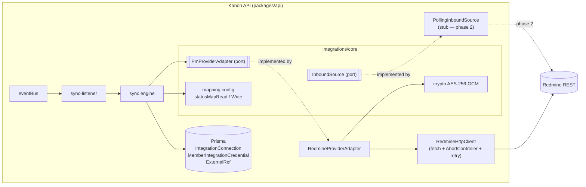
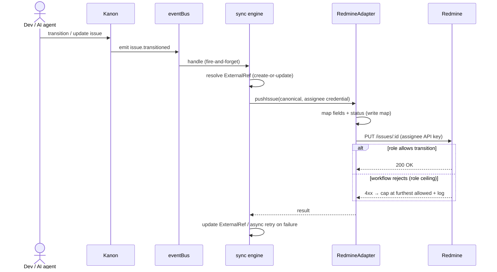

# ADR-0012: External PM Integrations — Provider-Agnostic Core + Redmine Outbound

- Status: Proposed
- Date: 2026-06-26
- Epic: external-pm-integrations
- Issue: KAN-179
- Related: ADR-0010 (work-session lifecycle), ADR-0008 (baseline snapshot)

## Context

Kanon is the developers' work surface. Project managers in our organization run their
process in **Redmine**, and other teams use **Jira** or **MS Project / Planner**. We want
devs to keep working in Kanon while PMs keep consuming in their existing engine, with Kanon
pushing the relevant data outward — projects, sprints, and tickets with assignee, estimate,
dates, progress, and status.

This must NOT be a Redmine-specific hack. We want one reusable, provider-agnostic core and a
thin adapter per provider, so adding Jira later is "another adapter", not a rewrite.

### Discovery against the real corp Redmine

We probed the live corp Redmine via its REST API to ground this design (token was provided
out-of-band and will be rotated):

- **Projects**: 46. **Trackers** (issue types): Desarrollo, Bug, Pedido de Cambio, Tarea.
- **Workflow**: a 17-state custom workflow (Nueva → Definir → Estimar → Cotizado → Para Dev →
  En Dev → Para QA → En QA → QA Rechazada → En UAT → UAT OK → UAT Rechazado → En Implementación
  → Implementada → Pausada → Descartada → Cerrada). Redmine **enforces transitions per ROLE** —
  a developer cannot move a ticket past QA.
- **Sprints = Redmine Versions** (vanilla, not the Agile plugin). `issue.fixed_version` carries
  e.g. `"Sprint Cortesia - 22/06/2026 - 04/07/2026"`.
- **Estimation = native `estimated_hours`** (Decimal hours, identical to Kanon's
  `IssueSchedule.estimateHours`). `done_ratio` (0–100) ↔ Kanon `progress`. `assigned_to`,
  `start_date`, `due_date` are native. **No custom fields required** for the MVP.
- The current Redmine **6.0.2 has no native webhooks**, so inbound requires polling (or a
  third-party plugin). Redmine 7.0.0 adds native webhooks without removing the REST resources
  used by the outbound adapter.

### Kanon-side facts (from the codebase)

- **IssueState** enum: `backlog | analysis | todo | in_progress | review | done`. There is **no
  `cancelled`/`blocked`** state. The Kanon state machine is **linear and guard-less** (any
  forward/backward transition allowed; only same-state is rejected) — so the "dev cannot pass
  QA" rule lives entirely in Redmine, not Kanon.
- Hours estimate + dates + progress live on `IssueSchedule` (1:1, optional). `estimate: Int?` on
  `Issue` is story points (separate from hours).
- An **event bus** (`services/event-bus`) emits `issue.transitioned`, `issue.updated`,
  `schedule.updated`, `estimate.revised`, `cycle.closed`. Modules subscribe via a
  `registerXListener(bus, log)` returning an unsubscribe fn, wired into `app` shutdown.
- A **self-rescheduling `setTimeout`** scheduler pattern already exists (work-session cleanup)
  and is reusable for future polling.
- **No reversible-encryption utility exists** — all token storage is one-way (`sha256Hex`,
  bcrypt). `node:crypto` (AES-256-GCM) is available.
- **No external-ref / integration-link table exists** today.

## Decision

1. **Ports & Adapters (hexagonal), inside the API package.** The integration subsystem lives at
   `packages/api/src/modules/integrations/`, following the existing `routes.ts` / `service.ts` /
   `schema.ts` module convention. A separate package was rejected — it would force re-exporting
   the Prisma client and event bus across package boundaries for no MVP gain.

   ```
   modules/integrations/
     core/        types.ts (canonical model + PmProviderAdapter port), sync-engine.ts,
                  crypto.ts, mapping.ts (status/field maps)
     providers/redmine/  adapter.ts, http-client.ts, mapper.ts
     inbound/     source.ts (InboundSource port), polling.ts (stub for phase 2)
     routes.ts service.ts schema.ts sync-listener.ts
   ```

2. **Canonical domain model.** The core speaks a normalized, provider-agnostic model
   (`CanonicalProject`, `CanonicalCycle`, `CanonicalIssue`, `CanonicalUser`) with `status`
   expressed as the Kanon `IssueState` enum — never a provider string. Adapters translate
   canonical ↔ provider. Shared response types that the web/MCP consume go in `@kanon/shared`;
   internal port types stay in the module.

3. **`PmProviderAdapter` port.** Every provider implements one interface:
   `capabilities()`, discovery (`listProjects/listStatuses/listVersions/whoAmI`), and outbound
   writes (`ensureProject`, `ensureCycle`, `pushIssue`). Inbound is a separate port (decision 8).

4. **Workspace-level connection + per-user credentials.** An `IntegrationConnection` is
   **scoped to one workspace** (one Redmine per Kanon workspace — covers "one company, one
   Redmine"; per-project connections are a later extension). It holds `baseUrl`, `provider`,
   `serviceCredentialId` (the admin's credential, used for discovery + as the optional write
   fallback), `discoveredStatuses` (cached `{id,name}` for the mapping UI), and the status maps
   (decision 10). Each member supplies **their own Redmine API key**, stored **encrypted** in
   `MemberIntegrationCredential`. On connect we call Redmine `/my/account.json` to resolve and
   persist the member's `externalUserId`/`externalLogin` — this binds KanonMember ↔ RedmineUser
   **without admin access or email matching**, and makes every outbound write attributable to
   the real user.

5. **Reversible credential encryption (resolves the only hard blocker).** Add an
   `INTEGRATION_ENCRYPTION_KEY` env var (32 bytes, base64; production-enforced in `env.ts`) and a
   `core/crypto.ts` using `node:crypto` **AES-256-GCM** (`{iv, ciphertext, authTag}` persisted).
   API keys are encrypted at rest and decrypted only at push time. No third-party crypto dep.

6. **Three additive Prisma tables.** `IntegrationConnection`, `MemberIntegrationCredential`
   (`@@unique([memberId, connectionId])`), and a polymorphic `ExternalRef`
   (`entityType ∈ {issue,project,cycle}`, `entityId`, `connectionId`, `externalId`, `externalUrl`,
   `@@unique([connectionId, entityType, entityId])` and `@@unique([connectionId, externalId])`).
   `ExternalRef` is the idempotency backbone — it prevents duplicate Redmine objects and records
   the link for drift detection and future inbound sync.

7. **Outbound MVP (Kanon → Redmine), event-driven and idempotent.** A `sync-listener`
   subscribes to `issue.transitioned/updated`, `schedule.updated`, `estimate.revised`,
   `cycle.closed`. On each event the sync engine resolves the `ExternalRef` (create-or-update),
   maps the canonical issue, and pushes via the assignee's credential:
   - **Field map**: `estimateHours → estimated_hours`, `progress → done_ratio`,
     `startDate/dueDate → start_date/due_date`, `assignee → assigned_to` (via `externalUserId`),
     Cycle → **Version** (`fixed_version`), project **full name** (Redmine `identifier` derived
     from the full name, never the short Kanon key).
   - **Status map** (per-connection, configurable; default below). Pushes set status on create
     and on dev-reachable transitions; because writes use the dev's token, **Redmine's
     role workflow naturally caps the dev at the QA handoff** — the PM-driven tail
     (UAT/Implementada/Cerrada) stays Redmine-owned. A workflow rejection is caught and the
     status is left at the furthest allowed value, logged, never fatal.
   - The listener is **fire-and-forget**: a failed push is logged and retried asynchronously
     (retry/dead-letter on `ExternalRef.metadata`), never propagated to the triggering mutation.

   **Default status map** (Kanon → Redmine; configurable per connection):

   | Kanon state | Redmine status (write default) |
   |-------------|--------------------------------|
   | backlog     | Nueva |
   | analysis    | Definir |
   | todo        | Para Dev |
   | in_progress | En Dev |
   | review      | Para QA |
   | done        | En QA *(dev ceiling; PM closes in Redmine — see phase 2)* |

8. **Inbound designed as a pluggable source, NOT built in MVP.** An `InboundSource` port has two
   implementations: `PollingInboundSource` (default — reuses the existing self-rescheduling
   `setTimeout`, queries `issues.json?updated_on>=lastSync`, works on any Redmine with no server
   change) and `WebhookInboundSource` (a `POST /api/integrations/:provider/webhook` receiver).
   Redmine 6.0.2 needs polling or a plugin; Redmine 7.0.0 can use its native webhook as a wake-up
   signal. Both normalize to the same canonical change event, durably refetch through REST, and
   retain overlapping polling because webhook delivery has no durable ordering/retry contract.
   This covers the **PM-closes → Kanon `done`** flow without tying the core to one Redmine version.

9. **Assignee-without-credential fallback (default: skip + warn).** If the issue's assignee has
   no connected Redmine credential, the push is **skipped and logged** (strict per-user
   attribution). An optional **workspace service token** on `IntegrationConnection` may be enabled
   later as a bot fallback; it is off by default to keep attribution honest and blast radius low.

10. **Admin configuration + per-user connect (UI).** The integration is **opt-in per workspace**
    and inert until configured — nothing breaks for a workspace without a connection. Setup is a
    workspace-admin settings screen (`web`), backed by integration endpoints:
    - **Connect**: admin enters `baseUrl` + their Redmine API key → Kanon validates
      (`/my/account.json`) and runs **discovery** (`/issue_statuses`, `/projects`, `/trackers`).
    - **Status mapping (mandatory)**: Kanon shows ALL discovered Redmine statuses; the admin maps
      each → a Kanon `IssueState` (the **read** map, many→one), pre-filled with a name-based
      best-guess the admin confirms. The **write** map (Kanon state → one Redmine status, used by
      outbound) is **derived** from the read map (the entry status of each group) with optional
      override — the admin never fills two grids. There is no universal default: every Redmine
      workflow differs (theirs has 17 states), so an explicit confirmed map gates sync activation.
    - **Per-user connect**: each member self-serves a "Connect my Redmine account" action (paste
      token → validated → encrypted + `externalUserId` stored). No manual admin user-mapping.
    Endpoints (sketch): `POST /integrations/connections`, `GET /integrations/connections/:id/discovery`,
    `PUT /integrations/connections/:id/mapping`, `POST /integrations/credentials`.

## Architecture diagrams

### Component view (hexagonal)



### Outbound sequence (Kanon → Redmine)



### Configuration + connect flow

```mermaid
sequenceDiagram
  actor Admin
  participant UI as Kanon Web
  participant API as Kanon API
  participant Redmine
  actor Dev

  Admin->>UI: baseUrl + admin API key
  UI->>API: POST /integrations/connections
  API->>Redmine: GET /my/account.json (validate)
  API->>Redmine: GET /issue_statuses, /projects, /trackers
  API-->>UI: discovered statuses (+ best-guess map)
  Admin->>UI: confirm/adjust status map
  UI->>API: PUT /integrations/connections/:id/mapping
  Note over API: read map saved; write map derived → connection active

  Dev->>UI: "Connect my Redmine account" + token
  UI->>API: POST /integrations/credentials
  API->>Redmine: GET /my/account.json
  API->>API: store encrypted key + externalUserId (bind member)
```

## Consequences

- One core, many providers: Jira becomes an adapter + auth + maps (story points vs hours, Agile
  sprints) with the core untouched. MS Project/Planner (Graph API, no native sprints) is last.
- Outbound is async and lossy-tolerant by design — Redmine being down never blocks a Kanon
  mutation; the retry/dead-letter must be observable (logged, inspectable on `ExternalRef`).
- Status mapping is inherently many-to-one on read and one-to-default on write; the configurable
  map plus the role-ceiling behavior means each team tunes its own flow without code changes. The
  `done → En QA` default is deliberate: a dev's "done" is a QA handoff in their workflow, and the
  terminal close is PM-owned and returns via inbound (phase 2).
- New env var `INTEGRATION_ENCRYPTION_KEY` is required to boot with integrations enabled; rotating
  it requires re-encrypting stored keys (or forcing re-connect). Document in deployment.
- Three new tables + Prisma regeneration; all additive (no data migration risk).
- Per-user tokens mean coverage depends on adoption — until a dev connects, their issues don't
  sync (skip+warn). Acceptable for MVP; the service-token option exists if blanket sync is needed.

## Alternatives considered

| Option | Rejected because |
|--------|------------------|
| Separate `packages/integrations` package | Forces re-exporting Prisma + event bus across package boundaries; no architectural gain at MVP scale. |
| Single admin/service token for the whole instance | Loses per-user attribution (audit), concentrates blast radius, and needs admin we may not get. Kept only as an optional fallback. |
| Bidirectional sync in the MVP | Opens source-of-truth/field-ownership and conflict resolution; doubles scope. Designed (inbound port) but deferred to phase 2. |
| Webhook-only inbound | Redmine 6.0.2 has no native webhooks, while 7.0.0 webhooks are asynchronous signals without a durable delivery/order contract. Polling and reconciliation remain the portable baseline; native/plugin webhooks are optional wake-up adapters. |
| Map Kanon `estimate` (story points) to Redmine | Redmine uses hours natively; Kanon's hours live on `IssueSchedule.estimateHours`. Story points would need a custom field we can't write as non-admin. |
| Hardcode the Redmine status map | Every team has a different workflow (theirs has 17 states); the map must be per-connection config, not code. |
| Project-level connection in MVP | A workspace-level connection covers "one company, one Redmine" and is simpler; per-project Redmines are an additive extension when a real multi-Redmine case appears. |
| Admin maps each Redmine user → Kanon member manually | Needs admin Redmine perms (non-admin token gets 403 on /users) and is tedious. Per-user self-serve token auto-binds via /my/account.json. |
