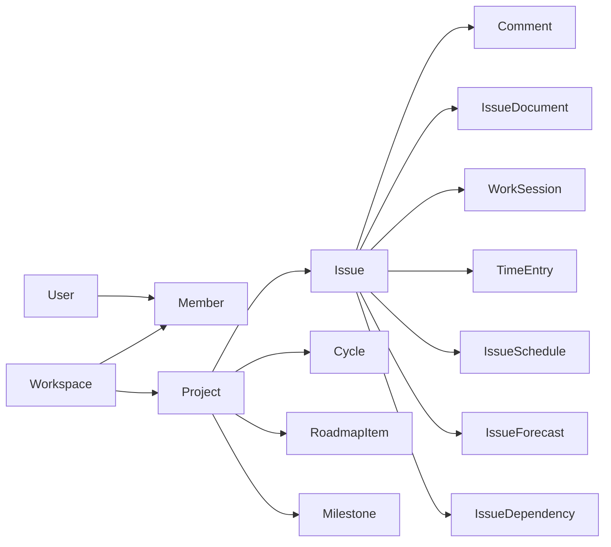

Kanon is multi-tenant around `Workspace`. A user joins a workspace through `Member`, which contains the workspace-local username, role, and agent flag. Projects belong to a workspace and own the planning graph.



## Core work model

`Issue` is the central aggregate. It stores identity, type, priority, state, labels, hierarchy, assignment, cycle membership, roadmap linkage, estimates, SDD metadata, and completion/time-confirmation timestamps.

Issue states are:

```text
backlog → analysis → todo → in_progress → review → done
```

Transitions can move forward or backward; same-state transitions are rejected. Moving backward is classified as a regression, and moving from `done` reopens the issue.

## Planning and PPM

- `Cycle` groups scoped issues and records velocity and scope-change events.
- `IssueDependency` supports `blocks`, finish-to-start, start-to-start, finish-to-finish, and start-to-finish relations with lag days.
- `IssueSchedule` stores mutable planning dates, progress, estimate hours, and baseline fields.
- `EstimateRevision` is append-only audit history for estimate changes.
- `IssueForecast` stores derived forecast dates, slip, float, and critical-path status.
- `Milestone` groups deliverable issues at project level.
- `TimeEntry`, `WorkSession`, and `WorkLog` separate submitted time, active capture, and immutable work history.

## Collaboration

Comments, mentions, notifications, subscriptions, activity logs, invitations, project membership, and issue documents form the collaboration layer. `CommentSource` records whether content originated from a human, MCP, synchronization process, system action, or ADR flow.

## AI-native concepts

`McpProposal` allows agents to suggest actions without applying them immediately. Proposals can promote roadmap items, add dependencies, split issues, reassign work, or carry a generic payload. They move through `pending`, `applied`, or `dismissed`.
