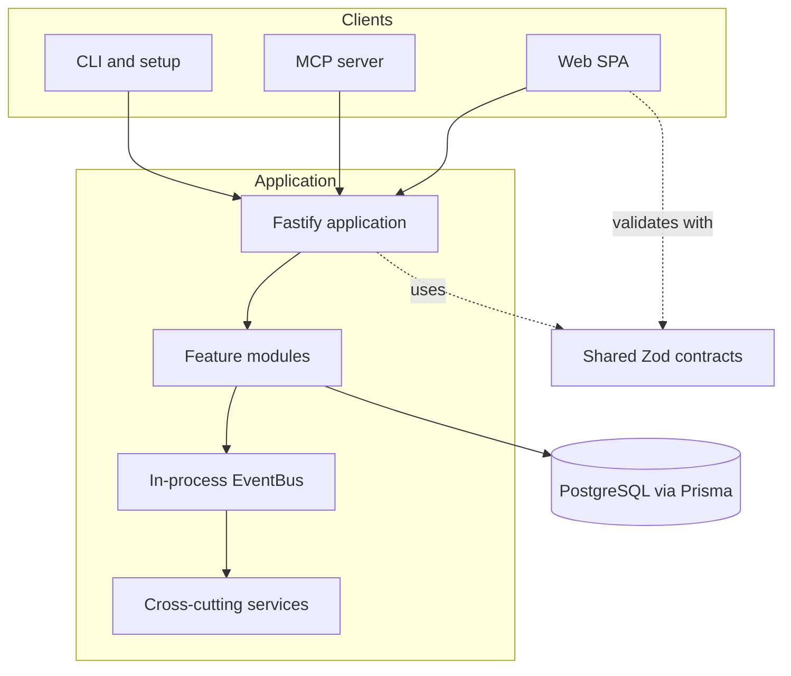

## Architectural style

Kanon is a **modular monolith** packaged as a pnpm monorepo. The API is the system of record and exposes domain capabilities through REST. The web and MCP packages are independent clients of that API rather than alternate business-logic implementations.

## Dependency direction

- `web` depends on `shared` and the public HTTP contract.
- `api` depends on `shared`, Prisma, Fastify, and infrastructure providers.
- `mcp` deliberately owns its REST client and does not import the API package.
- `setup` configures external AI tools and credentials; it does not contain domain logic.
- `shared` has no dependency on application packages and remains the lowest reusable layer.

## API composition root

`packages/api/src/app.ts` is the composition root. It creates Fastify, installs validation and security plugins, decorates the app with the event bus, registers event-driven services, and mounts all feature routes.

The startup order is significant:

1. Validation and serialization compilers.
2. CORS, Helmet, rate limiting, cookies, error handling, authentication, provenance and CSRF.
3. Metrics and domain event infrastructure.
4. Notification, forecast, and work-session listeners.
5. Health checks and feature routes.
6. First-boot setup and periodic cleanup hooks.

## Main boundaries

| Boundary | Owns | Does not own |
| --- | --- | --- |
| API modules | Business operations, authorization, transactions, persistence | Browser state or MCP protocol |
| Web | Rendering, navigation, user interaction, query caching | Canonical domain rules |
| MCP | Tool schemas, agent guidance, API adaptation, heartbeat/SSE client | Database access |
| Shared | Runtime schemas and portable domain types | Stateful services |
| Setup | Client detection, onboarding, config mutation, credential storage | Project-management behavior |

<Note>
The event bus is process-local. It provides decoupling and SSE replay inside one API process, but it is not a durable distributed message broker.
</Note>
