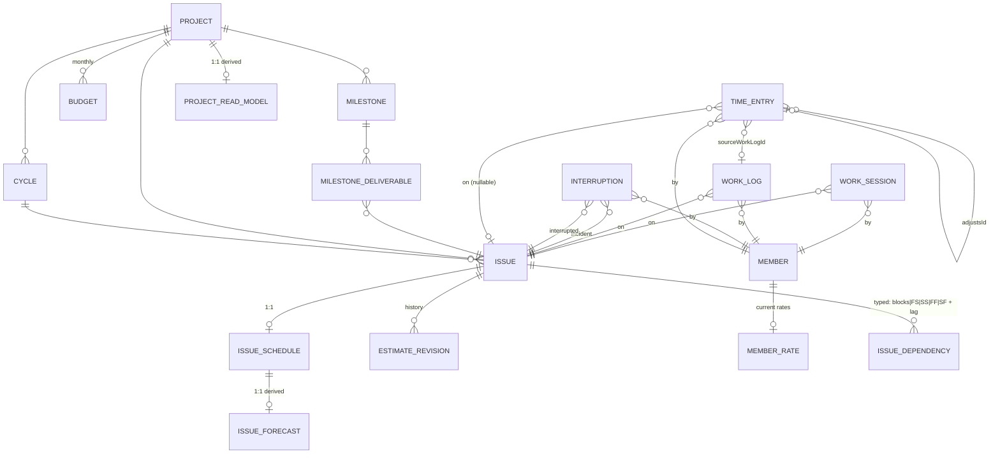
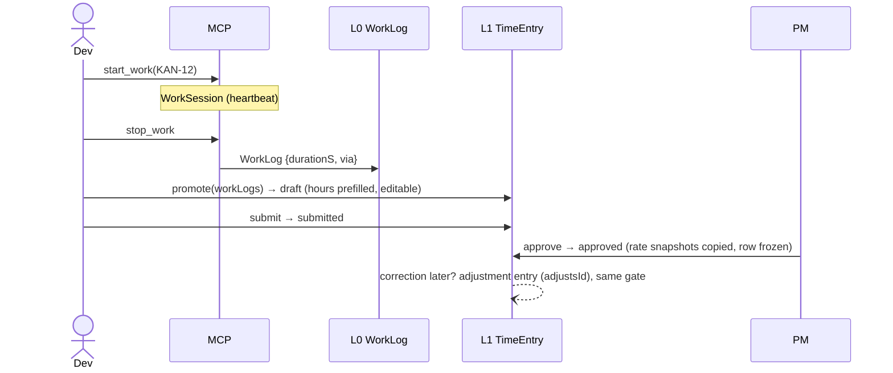
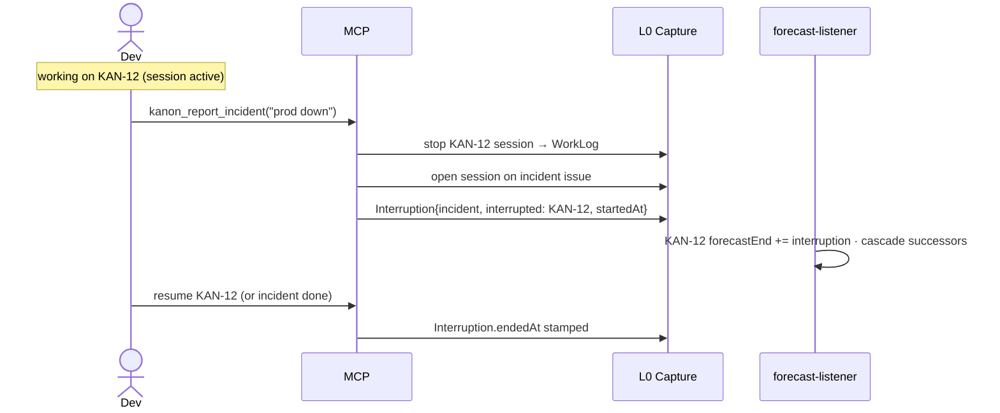
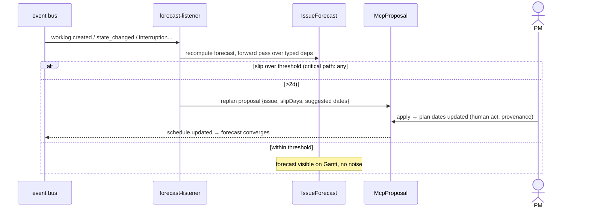

# Kanon PPM Engine — Conceptual Architecture

- Status: Living document
- Date: 2026-06-12
- Decisions it draws from: ADR-0001 (hours gate), ADR-0002 (money model), ADR-0003 (materialization), ADR-0004 (scheduling), ADR-0005 (work-capture & scheduling data model), PRD-0001 (product scope), PDR-0002 (provenance), PDR-0003 (write policy)
- Source of truth: `docs/architecture/ppm-engine.md` — mirrored as RFC on KAN-98

## 1. Purpose & reading guide

This document is the single conceptual view of the PPM engine: every entity, which layer owns it, how data flows from a dev's work session to a C-level portfolio row. It does **not** prescribe file layout, endpoints, or migrations — each implementation slice (KAN-99..105, PPM P1/P2 roadmap items) carries its own SDD design against this map.

One sentence summary: **machine-captured work flows upward through human gates into immutable facts, and derived engines project those facts into live schedules and portfolio health — never the other way down.**

## 2. The four layers

```
        ┌─────────────────────────────────────────────────────────────┐
   L3   │  PRESENTATION    Gantt (3 planes) · PM dashboard · Portfolio │  zero-compute reads
        │                  MCP read tools · SSE live updates           │
        ├─────────────────────────────────────────────────────────────┤
   L2   │  DERIVED         IssueForecast · ProjectReadModel            │  rebuildable, engine-written
        ├─────────────────────────────────────────────────────────────┤
   L1   │  CANONICAL       TimeEntry · IssueSchedule (plan+baseline)   │  human-gated,
        │                  EstimateRevision · MemberRate · Budget      │  immutable after approval
        │                  Milestone                                   │
        ├─────────────────────────────────────────────────────────────┤
   L0   │  CAPTURE         WorkSession → WorkLog · Interruption        │  machine truth,
        │                  ActivityLog · CycleScopeEvent               │  append-only, never edited
        └─────────────────────────────────────────────────────────────┘
                    ▲ writes flow up through gates · events flow right →
```

| Layer | Invariant | Who writes |
|-------|-----------|------------|
| **L0 Capture** | Append-only. No UPDATE path exists anywhere. Bad data is *not promoted*, never fixed in place. | Sessions/agents (with `via` provenance) |
| **L1 Canonical** | Human-gated. Financial facts (`approved` TimeEntry) immutable — corrections are new rows (`adjustsId`). Plan dates move only by human action or applied proposal. | Devs, PMs, applied McpProposals |
| **L2 Derived** | Fully recomputable from L0+L1. Droppable, rebuildable (`rebuild*` jobs). Only the engines write here. | forecast-listener, rollup-listener |
| **L3 Presentation** | Zero compute on read — serves L2 rows verbatim. | Nobody (read-only) |

The **trust boundary** is L0→L1: promotion + approval is where machine capture becomes a billable/plannable fact (ADR-0001). The **freshness boundary** is L1→L2: eventual consistency, staleness visible via `computedAt`/`lastCalc` (ADR-0003).

## 3. Entity map



Field-level detail lives in the ADRs: `IssueSchedule`/`EstimateRevision`/`TimeEntry`/`IssueForecast`/`Interruption` in ADR-0005, `MemberRate`/`Budget` in ADR-0002, `Milestone` in ADR-0004, `ProjectReadModel` in ADR-0003.

Key relationship semantics:

- **`TimeEntry.sourceWorkLogId`** — provenance from capture to fact. Nullable: manual entries allowed, but the product pushes promotion (PRD-0001: ≥80% promoted target).
- **`TimeEntry.adjustsId`** — accounting-style amendment chain. Negative hours legal only here.
- **`IssueDependency.type`** — `blocks` = workflow gate (existing semantics, untouched); `FS/SS/FF/SF` + `lagDays` = schedule constraints consumed only by the forecast engine.
- **`Interruption`** — the displacement edge: *this incident stole time from that issue*. Feeds both forecast (slip) and PPM narrative (unplanned work).
- **Three schedule planes on one issue**: baseline (in `IssueSchedule.baseline*`, snapshotted at cycle activation), plan (`IssueSchedule.startDate/dueDate`), forecast (`IssueForecast.*`, derived).

## 4. Event spine

One in-process bus (existing `services/event-bus/`), two derived-layer listeners, SSE re-emit to clients. The same spine later receives webhook ingest (stage 3, PDR-0003).

| Domain event | forecast-listener recomputes | rollup-listener recomputes |
|---|---|---|
| `worklog.created` | issue forecast (progress extrapolation) | — |
| `time-entry.approved` / `.rejected` | issue forecast | actualCost, billedRevenue, CPI, costHealth |
| `estimate.revised` | issue forecast | plannedValue, SPI inputs |
| `issue.state_changed` | issue forecast | earnedValue, SPI, scheduleHealth |
| `schedule.updated` (plan edit) | issue + successors | scheduleHealth |
| `dependency.changed` | affected subgraph | — |
| `interruption.opened` / `.closed` | interrupted issue + successors | unplanned-work bucket |
| `cycle.activated` | — (baseline snapshot is a write, L1) | scopeLine |
| `cycle.scope_changed` | — | scopeCreep, scopeHealth |
| `budget.upserted` | — | costHealth |
| `member-rate.updated` | — | nothing retroactive (snapshots, ADR-0002) |
| `ppm.forecast.updated` (re-emit) | — | scheduleHealth, SPI (reads IssueForecast) |

Both listeners are debounced per project, fire-and-forget after the write commits, and have rebuild jobs (`rebuildProjectForecast`, `rebuildProjectReadModel`) as the dropped-event backstop. Durable delivery (broker/queue, retry, DLQ) is the "Event-delivery substrate" roadmap item — out of scope here, the listener contract doesn't change when it lands.

## 5. Key flows

### 5.1 Capture → fact (the trust pipeline)



### 5.2 Estimation (analysis state)

`backlog → analysis`: dev (or agent via McpProposal, PRD-0004) sets `estimateHours` → `EstimateRevision` appended, current value on `IssueSchedule` → `estimate.revised` event. Re-estimation any time: another revision, history intact.

### 5.3 Incident interrupt



### 5.4 Slip → replan (escalation, never mutation)



### 5.5 Cycle activation → baseline

`Cycle upcoming → active` (existing state machine): every issue in the cycle snapshots plan dates into `baseline*` + `baselineSetAt` (ADR-0004). Re-baseline = explicit admin action only.

## 6. Money math (read-model formulas)

All financial aggregation reads **approved TimeEntry only** (ADR-0001), with rates from the entry's own snapshots (ADR-0002) — never joined to current `MemberRate`.

| Figure | Formula |
|---|---|
| `actualCost` (AC) | Σ approved hours × `costRateSnapshot` |
| `billedRevenue` | Σ approved hours × `billRateSnapshot` |
| `revenue` | `tm` → billedRevenue · `fixed` → Σ active Budget rows · `internal` → 0 |
| `margin` | revenue − actualCost |
| `plannedValue` (PV) | Σ `estimateHours` of scheduled work to date × cost rate |
| `earnedValue` (EV) | Σ `estimateHours` × progress of done/in-flight work × cost rate |
| `SPI` | EV / PV (schedule) — feeds scheduleHealth with forecast slip |
| `CPI` | EV / AC (cost) — cost basis, not bill (ADR-0002) |
| unplanned work | Σ approved hours on `type = incident` issues |

Budget periods are **monthly**; quarter = rollup (PRD-0001). Single currency in v1; FX snapshot seam documented in ADR-0002.

## 7. Conceptual module boundaries

Six engine concerns — module/file layout is each slice's SDD design decision:

| Module | Owns | Layer |
|---|---|---|
| **capture** | WorkSession lifecycle, WorkLog write, Interruption write, heartbeat/TTL | L0 |
| **timesheet** | TimeEntry promote/submit/approve/adjust, PM-role gate | L1 |
| **schedule** | IssueSchedule plan CRUD, EstimateRevision, baseline snapshot, Milestone, typed deps | L1 |
| **forecast** | forecast-listener, forward pass, critical path, slip threshold → proposal, rebuild job | L2 |
| **money** | MemberRate, Budget CRUD, approval-time snapshot hook | L1 |
| **readmodel** | rollup-listener, ProjectReadModel, portfolio query, rebuild job | L2 |

Cross-cutting: **provenance** (`via` + human owner on every write, PDR-0002), **proposals** (judgment-bearing writes land as McpProposal first, PDR-0003), **event bus** (the spine).

## 8. Invariants (the audit contract)

| # | Invariant | Enforced at |
|---|---|---|
| 1 | WorkLog rows are never updated or deleted | no UPDATE path in capture module |
| 2 | Approved TimeEntry is immutable; only adjustment entries amend it | timesheet service guard |
| 3 | Negative hours require `adjustsId` | DB check + service |
| 4 | Rollups never read `MemberRate`, only entry snapshots | readmodel queries |
| 5 | Plan dates change only via human action or applied proposal | schedule service (no system writer) |
| 6 | L2 tables have exactly one writer (their engine) and are rebuildable | module ownership |
| 7 | Every L0/L1 write carries `via` + resolves to a human owner | provenance middleware |
| 8 | Baseline is written only by cycle activation or explicit re-baseline | schedule service |
| 9 | `estimateHours` changes always append an EstimateRevision | schedule service |

## 9. Future seams (prepared, not built)

- **Multi-currency**: FX snapshot at approval + base-currency normalization in read-model (`currency` columns already planned, ADR-0002).
- **Forecasting v2**: probabilistic ETA / Monte Carlo as a second derived consumer of the same L0/L1 data — new engine, no schema break (PRD-0001 v2 intent).
- **Webhook ingest (stage 3)**: external events (PR merged, CI failed) enter the same event spine; deterministic ones map to domain events, judgment-bearing ones become proposals (PDR-0003).
- **Capacity planning**: `MemberRate.hoursPerWeek` + load semaphore are the seam (PRD-0001 non-goal v1).
- **Forecast formula evolution**: naive extrapolation v1 → calendar-aware/velocity-weighted later; bump + rebuild, no read-path change (ADR-0003 pattern).
