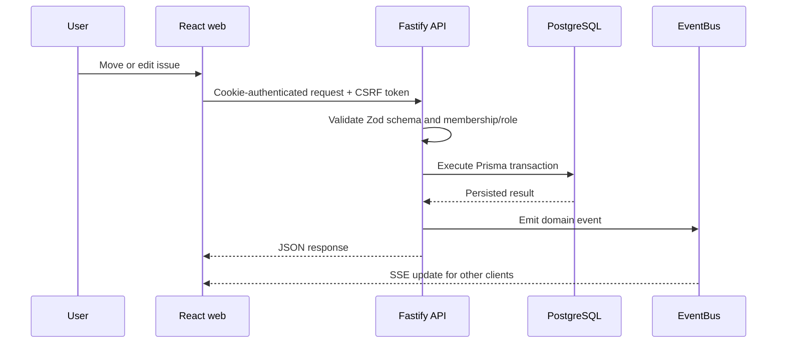
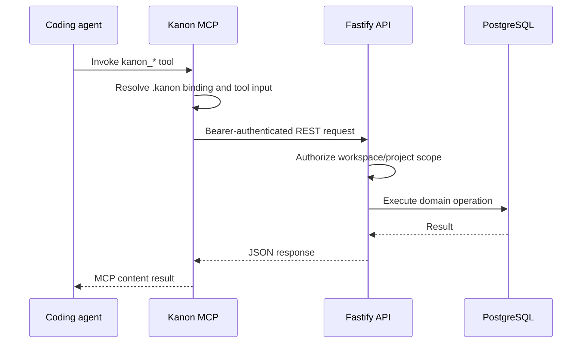

## Browser mutation

The web client uses a central fetch wrapper. Cookies carry authentication, mutation requests include the double-submit CSRF token, failed access tokens trigger a refresh attempt, and shared Zod schemas can validate successful responses at runtime.

## Agent operation

The MCP process communicates over stdio with the host agent and over HTTP with Kanon. It attaches client identity for provenance, can consume workspace SSE events, and wraps tool activity with heartbeat tracking.

## Event-driven side effects

Mutations publish typed domain events after their primary operation. Subscribers are isolated: a subscriber failure is logged but does not abort later subscribers or the original mutation. Current consumers include notifications, forecast rebuilds, work-session transitions, and workspace SSE streams.
