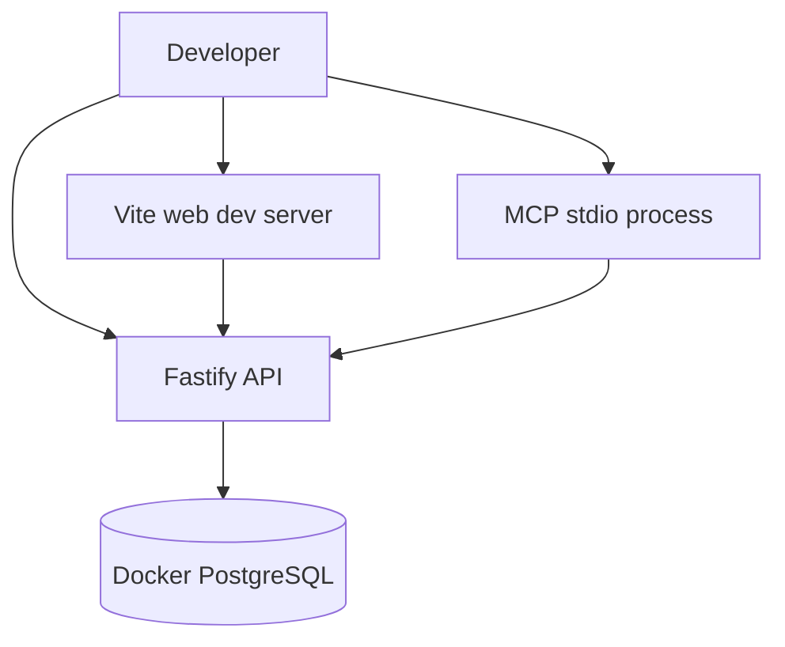

## Requirements

- Node.js 20 or newer
- pnpm 10
- Docker with Compose

## Bootstrap

```bash
git clone https://github.com/mmmarxdr/kanon.git
cd kanon
pnpm bootstrap
pnpm dev:start
```

`bootstrap` installs workspace dependencies, generates Prisma artifacts, applies migrations, and builds the MCP and setup packages. `dev:start` starts PostgreSQL, the API, the web application, and the MCP development processes.

Open `http://localhost:5173` and use the seeded development account:

```text
Email: dev@kanon.io
Password: Password123!
Workspace: kanon-dev
```

## Important commands

```bash
pnpm dev:start
pnpm dev:stop
pnpm test:all
pnpm e2e
pnpm lint
pnpm format:check
pnpm db:studio
```

## Development topology



<Tip>
Use package filters when working on one boundary, for example `pnpm --filter @kanon/api test` or `pnpm --filter @kanon/web dev`.
</Tip>
