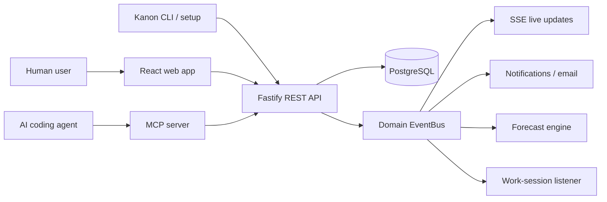

Kanon is an AI-native project management platform where humans use a React application and coding agents use an MCP server. Both clients operate on the same Fastify API and PostgreSQL data model.

<CardGroup cols={2}>
  <Card title="Architecture overview" icon="sitemap" href="/docs/architecture/overview">
    Understand packages, boundaries, data ownership, and communication paths.
  </Card>
  <Card title="Module reference" icon="boxes-stacked" href="/docs/modules/api">
    Explore the API, web, MCP, shared contracts, setup tooling, CLI, and tests.
  </Card>
  <Card title="Runtime flows" icon="arrows-rotate" href="/docs/architecture/runtime-flows">
    Follow requests from the browser or an AI agent through the system.
  </Card>
  <Card title="Local development" icon="terminal" href="/docs/getting-started">
    Bootstrap and run the complete monorepo locally.
  </Card>
</CardGroup>

## Core design

Kanon follows a modular-monolith architecture around a central REST API. Feature modules own their routes and business logic, Prisma owns persistence, and an in-process domain event bus decouples mutations from secondary effects such as notifications, forecasts, live updates, and work-session lifecycle changes.

## Package map

| Package | Responsibility |
| --- | --- |
| `@kanon/api` | HTTP boundary, authentication, domain modules, event dispatch, persistence |
| `@kanon/web` | Human-facing SPA, server-state queries, local UI state, live updates |
| `@kanon/mcp` | MCP tools that translate agent actions into API calls |
| `@kanon/shared` | Zod schemas and cross-package domain contracts |
| `@kanon-pm/setup` | Installer and onboarding flow for supported AI tools |
| `@kanon/cli` | Small operator/developer command-line surface |
| `@kanon/e2e` | Playwright system tests against the running stack |
