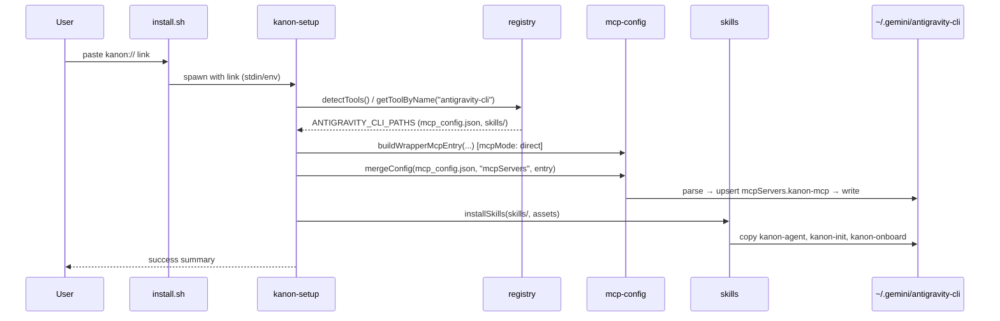

# Design: Antigravity CLI Integration (KAN-130)

## Status: draft — Date: 2026-06-17

## Technical Approach

Add first-class **Antigravity CLI** (`agy`) support to `packages/setup` by mirroring the **OpenCode / Codex product-surface pattern**: MCP + skills only, registry G5 contract tests, composed-primitive smoke tests, and leakage guards. Unlike Codex (KAN-128), **no new config adapter** — Antigravity CLI uses JSON `mcpServers` at `~/.gemini/antigravity-cli/mcp_config.json`, which existing `mergeConfig()` / `removeConfig()` / `formatMcpEntry()` already handle.

Single registry entry `antigravity-cli`; global install only. No API or MCP server changes — wrapper-cli is tool-agnostic.

---

## Architecture Decisions

| Decision | Choice | Alternatives rejected | Rationale |
|---|---|---|---|
| Registry identity | Separate entry `antigravity-cli` | Extend existing `antigravity` (IDE) entry | IDE (`~/.gemini/antigravity/`) and CLI (`~/.gemini/antigravity-cli/`) are sibling dirs with different surfaces (IDE has template/agents/workflows; CLI has none). WSL semantics differ (`wsl-bridge` vs `direct`). Dual detection on one machine is expected. |
| Config write path | Reuse JSON `mergeConfig` / `removeConfig` | New adapter, shell-out to `agy` | Verified v1.0.9 shape matches Claude/Cursor/IDE Antigravity (`mcpServers` object form). `installToolMcpConfig()` already dispatches JSON when `configFormat !== "toml"`. |
| WSL path resolution | `ctx.homedir` + `mcpMode: "direct"` | Reuse IDE `wsl-bridge` → `ctx.winHome` | `agy` runs natively in WSL Linux (`~/.local/bin/agy`); config lives in WSL `~/.gemini/antigravity-cli/`, not Windows `%USERPROFILE%\.gemini\`. |
| Detection strategy | `commandExists("agy")` OR `mcp_config.json` OR `antigravity-cli/` dir | IDE path only; `settings.json` as signal | Binary check works before first MCP config; config file is strongest fallback without PATH; `settings.json` is UI prefs only (MCP moved out per Gemini CLI migration). Must NOT match `~/.gemini/antigravity/` (IDE). |
| Home override | None — hardcode `~/.gemini/antigravity-cli/` via `ctx.homedir` | `resolveAntigravityCliHome()` env var | Official docs do not document a `CODEX_HOME`-style override. Add resolver only if `agy` ships one. |
| Product surface | MCP merge + skills only | Template (`GEMINI.md`), agents, workflows, commands | CLI has no global agents/workflows/commands dirs. `settings.json` and `keybindings.json` are personal — must not write. |
| Platforms | `darwin`, `linux`, `wsl`, `win32`; shared `ANTIGRAVITY_CLI_PATHS` | Per-platform path blocks; omit `darwin` | Path layout is homedir-relative and identical across platforms; only `PlatformContext.homedir` resolution differs. CLI is cross-platform (unlike IDE `antigravity`, which omits `darwin`). |
| Display name | `"Antigravity CLI"` | `"AGY CLI"`; `--tool agy` alias | Matches product page; defer alias until user feedback (YAGNI). |

---

## Module Design

### `ANTIGRAVITY_CLI_PATHS` — `registry.ts`

Shared `PlatformPaths` const referenced by all four platform blocks (same pattern as `OPENCODE_PATHS` / `CODEX_PATHS`):

```typescript
const ANTIGRAVITY_CLI_PATHS: PlatformPaths = {
  detect: async (ctx) =>
    commandExists("agy", ctx.platform) ||
    fs.existsSync(
      path.join(ctx.homedir, ".gemini", "antigravity-cli", "mcp_config.json"),
    ) ||
    fs.existsSync(path.join(ctx.homedir, ".gemini", "antigravity-cli")),
  config: (ctx) =>
    path.join(ctx.homedir, ".gemini", "antigravity-cli", "mcp_config.json"),
  skills: (ctx) =>
    path.join(ctx.homedir, ".gemini", "antigravity-cli", "skills"),
  mcpMode: "direct",
};
```

**Detection priority:** (1) `agy` on PATH, (2) `mcp_config.json` exists, (3) `antigravity-cli/` dir exists.

**Explicitly excluded from detect:** `~/.gemini/antigravity/` (IDE), `settings.json`, workspace `.agents/mcp_config.json`.

### Registry entry sketch

```typescript
{
  name: "antigravity-cli",
  displayName: "Antigravity CLI",
  rootKey: "mcpServers",
  // configFormat omitted → json default
  templateSource: "",
  templateMode: "marker-inject",
  platforms: {
    darwin: ANTIGRAVITY_CLI_PATHS,
    linux: ANTIGRAVITY_CLI_PATHS,
    wsl: ANTIGRAVITY_CLI_PATHS,
    win32: ANTIGRAVITY_CLI_PATHS,
  },
}
```

No `template`, `agents`, `workflows`, or `commands` resolvers — `index.ts` branches skip absent paths automatically.

### Reuse of existing JSON `mergeConfig`

**No `mcp-config.ts` changes expected.**

| Function | Role for Antigravity CLI |
|----------|--------------------------|
| `formatMcpEntry("mcpServers", entry)` | Returns `{ command, args, env? }` — correct object form |
| `mergeConfig(configPath, "mcpServers", entry)` | Idempotent upsert of `mcpServers.kanon-mcp` |
| `removeConfig(configPath, "mcpServers")` | Removes `kanon-mcp`; preserves other servers (e.g. `context7`, `engram`) |
| `extractExistingAuth` / `extractExistingWorkspaceId` | Already parse JSON `mcpServers.kanon-mcp` |
| `installToolMcpConfig` / `removeToolMcpConfig` in `index.ts` | JSON path when `configFormat !== "toml"` — no dispatch change |

**On-disk target (wrapper mode):**

```json
{
  "mcpServers": {
    "kanon-mcp": {
      "command": "<nodeBin>",
      "args": ["<wrapper-cli.js>", "--server", "<canonicalUrl>"],
      "env": { "KANON_WORKSPACE_ID": "<id>" }
    }
  }
}
```

`env` block only when re-run preserves workspace binding; matches other JSON tools.

---

## `index.ts` Dispatch Flow

No new dispatch branch required — Antigravity CLI uses the default JSON path:

```
run() per selected tool
        │
        ├── configFormat === "toml"?  → NO (antigravity-cli uses json default)
        │
        └── install → mergeConfig(configPath, "mcpServers", entry)
            remove  → removeConfig(configPath, "mcpServers")

        ├── installSkills(~/.gemini/antigravity-cli/skills, assets)  ← always
        ├── template / agents / workflows / commands branches       ← skipped (no paths)
        └── extractExistingWorkspaceId                              ← existing JSON branch
```

Update `--tool` help string to include `antigravity-cli`.

---

## Install Flow (Sequence)



**WSL note:** On WSL, `FS` resolves to WSL Linux homedir (`ctx.homedir`), not Windows host. IDE `antigravity` would bridge to `ctx.winHome` — CLI does not.

---

## IDE vs CLI Comparison

| Dimension | IDE `antigravity` | CLI `antigravity-cli` |
|-----------|-------------------|------------------------|
| Config | `~/.gemini/antigravity/mcp_config.json` | `~/.gemini/antigravity-cli/mcp_config.json` |
| Skills | `~/.gemini/antigravity/skills/` | `~/.gemini/antigravity-cli/skills/` |
| WSL `mcpMode` | `wsl-bridge` → `ctx.winHome` | `direct` → `ctx.homedir` |
| Template | `GEMINI.md` marker-inject | **None** |
| Agents / workflows | Yes | **None** |
| Platforms | `win32`, `wsl`, `linux` (no `darwin`) | `darwin`, `linux`, `wsl`, `win32` |

Both may be detected and configured independently — no path collision.

---

## File Changes

| File | Action | Description |
|------|--------|-------------|
| `packages/setup/src/registry.ts` | Modify | `ANTIGRAVITY_CLI_PATHS` const + `antigravity-cli` entry |
| `packages/setup/src/index.ts` | Modify | `--tool` help string includes `antigravity-cli` |
| `packages/setup/src/__tests__/registry.test.ts` | Modify | G5-style `describe("registry — antigravity-cli")` |
| `packages/setup/src/__tests__/antigravity-cli-install-smoke.test.ts` | Create | Composed install/remove smoke (mirror OpenCode) |
| `packages/setup/src/__tests__/leakage-guard.test.ts` | Modify | Forbid `settings.json`, `GEMINI.md`, `keybindings.json` |
| `docs/AI_TOOLS.md` | Modify | Antigravity CLI row + paths table |
| `packages/setup/assets/skills/kanon-onboard/SKILL.md` | Modify | CLI troubleshooting (IDE vs CLI, WSL direct) |

**Out of scope:** `packages/api`, `packages/mcp`, `mcp-config.ts` core (unless auth-extraction edge case found), IDE `antigravity` entry changes, workspace `.agents/mcp_config.json`.

---

## Testing Strategy

| Layer | What to Test | Approach |
|-------|-------------|----------|
| Registry contract | Entry shape, `rootKey`, platforms, `mcpMode`, paths, no template/agents/commands/workflows | `registry.test.ts` — mirror codex/opencode G5 block |
| Install smoke | `mergeConfig` + `installSkills` + remove + idempotency + leakage walk | `antigravity-cli-install-smoke.test.ts` — temp homedir, composed primitives (NOT `run()`) |
| Leakage guard | Config/skills paths must not resolve to personal files | Extend `leakage-guard.test.ts` |
| Regression | IDE `antigravity` G5 tests unchanged | Existing suite |

Runner: `pnpm --filter @kanon-pm/setup test`

Smoke test drives composed primitives with real `getToolByName("antigravity-cli")` and temp-homedir `PlatformContext` — same rationale as OpenCode/Codex smoke.

---

## Alternatives Considered

| Approach | Why rejected |
|---|---|
| Extend `antigravity` IDE entry with CLI paths | Different WSL semantics, install surfaces, and detection signals; would conflate `--tool antigravity` with CLI expectations |
| WSL `wsl-bridge` for CLI | CLI runs in WSL Linux homedir; Windows-path writes would miss the runtime |
| Detect via `settings.json` | UI prefs only; not an MCP indicator; writing it is a leakage risk |
| Write `~/.gemini/GEMINI.md` template | IDE-only surface; shared file with IDE entry — CLI must not touch |
| `--tool agy` alias | YAGNI until user feedback |
| Fallback to `~/.gemini/config/mcp_config.json` | Future Antigravity 2.0 migration path; monitor `agy` CHANGELOG; not in initial scope |
| New JSON adapter in `mcp-config.ts` | Existing `mergeConfig` already handles `mcpServers` object form |

---

## Migration / Rollout

No migration required. Ships in next setup tarball cut.

**Manual rollback:**

1. Delete `mcpServers.kanon-mcp` from `~/.gemini/antigravity-cli/mcp_config.json`.
2. Remove `kanon-agent`, `kanon-init`, `kanon-onboard` under `~/.gemini/antigravity-cli/skills/`.

IDE `antigravity` entry unaffected.

---

## Open Questions

- [ ] Confirm win32 `PlatformContext.homedir` resolves to `%USERPROFILE%` → `%USERPROFILE%\.gemini\antigravity-cli\` during implement verify.
- [ ] Monitor `agy` CHANGELOG for path migration to `~/.gemini/config/mcp_config.json`; add fallback detection if canonical path moves.
