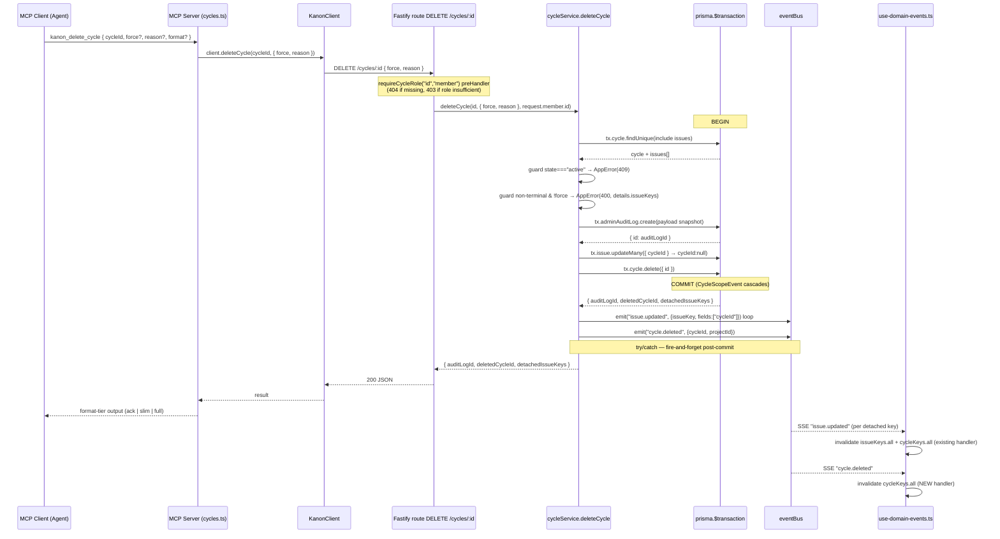

# Technical Design: kan-23-delete-cycle

## 1. Architecture Overview

The delete primitive flows through six packages along the standard Kanon mutation spine. An MCP agent invokes `kanon_delete_cycle` (registered in `packages/mcp/src/tools/cycles.ts`); the tool delegates to `KanonClient.deleteCycle` (`packages/mcp/src/kanon-client.ts`) which issues `DELETE /cycles/:id` with a JSON body. Fastify routes the call in `packages/api/src/modules/cycle/routes.ts` behind the existing `requireCycleRole("id", "member")` preHandler, which 404s missing cycles and resolves `request.member.id`. The route calls `cycleService.deleteCycle(id, opts, authorId)` (new file `packages/api/src/modules/cycle/delete-cycle.ts`), which runs a single `prisma.$transaction` that re-fetches the cycle, applies the active-state and non-terminal guards, writes one `AdminAuditLog` row with a full snapshot, calls `tx.issue.updateMany` to detach issues, and finally `tx.cycle.delete` (cascading `CycleScopeEvent` rows via Postgres). After the tx commits, the service emits `issue.updated` per detached key and one `cycle.deleted` event via the in-process `eventBus`, fire-and-forget. The web subscribes through `packages/web/src/hooks/use-domain-events.ts`; a new `cycle.deleted` listener invalidates `cycleKeys.all` so `useCyclesQuery` refetches and `CyclesView` falls back to `activeCycle ?? cycles?.[0]`. Shared response types live in `packages/bridge/src/types.ts` (consumed by `kanon-client.ts` and `delete-cycle.ts`).

## 2. Sequence Diagram



## 3. Schema Migration Design

**Migration name:** `add-admin-audit-log` — generated with `pnpm --filter @kanon/api prisma migrate dev --name add-admin-audit-log`.

**Schema delta** — append to `packages/api/prisma/schema.prisma`:

```prisma
model AdminAuditLog {
  id         String   @id @default(uuid()) @db.Uuid
  entityType String   @map("entity_type")
  entityId   String   @map("entity_id")
  action     String
  payload    Json     @db.JsonB
  authorId   String?  @map("author_id") @db.Uuid
  reason     String?
  createdAt  DateTime @default(now()) @map("created_at")

  author     Member?  @relation(fields: [authorId], references: [id], onDelete: SetNull)

  @@index([entityType, entityId])
  @@index([authorId])
  @@index([createdAt])
  @@map("admin_audit_logs")
}
```

**Inverse relation on existing `Member` model** (lines 323–345 of `schema.prisma`, append to relations block):

```prisma
model Member {
  // ... existing fields and relations unchanged
  cycleScopeEvents CycleScopeEvent[] @relation("CycleScopeAuthor")
  adminAuditLogs   AdminAuditLog[]
}
```

**Notes:**
- `entityId` is `String` (NOT `@db.Uuid`) so the row survives entity deletion across future entity types (`"issue"`, `"project"`) where IDs may follow different formats.
- `authorId` is nullable + `onDelete: SetNull` so deleting a Member never destroys audit history (forensic invariant).
- `reason` is nullable, no max-length at DB level — application-layer Zod caps at 500 chars.
- All three indexes are required by proposal section 3.1: `[entityType, entityId]` for entity history queries (future KAN-25 admin UI), `[authorId]` for per-author audit views, `[createdAt]` for time-range scans.

## 4. Type Definitions

| Location | Symbol | Purpose |
|---|---|---|
| `packages/bridge/src/types.ts` | `KanonCycleDeleteResult` | Shared response shape consumed by `KanonClient.deleteCycle` and `delete-cycle.ts` (see proposal section 3.2 / spec REQ-API-RESPONSE-001). |
| `packages/api/src/modules/cycle/routes.ts` | `DeleteCycleBody` (Zod) | Route body schema. |
| `packages/api/src/modules/cycle/delete-cycle.ts` | `deleteCycle` (function) | Service function — exported and re-exported from `service.ts` (or imported directly in routes). |
| `packages/api/src/modules/cycle/delete-cycle.ts` | `NON_TERMINAL_STATES` | `as const` tuple of issue states that block deletion without `force`. |
| `packages/mcp/src/types.ts` | `DeleteCycleShape` | Tool input shape for Zod. |
| `packages/mcp/src/kanon-client.ts` | `KanonClient.deleteCycle(id, opts)` | HTTP client method. |
| `packages/api/src/services/event-bus/types.ts` | `DomainEventType` | Extend union to include `"cycle.deleted"`. |

**Concrete shapes:**

```ts
// packages/bridge/src/types.ts
export interface KanonCycleDeleteResult {
  deletedCycleId: string;
  detachedIssueKeys: string[];
  auditLogId: string;
}
```

```ts
// packages/api/src/modules/cycle/routes.ts
const DeleteCycleBody = z.object({
  force: z.boolean().optional().default(false),
  reason: z.string().min(1).max(500).optional(),
});
```

```ts
// packages/mcp/src/types.ts
export const DeleteCycleShape = {
  cycleId: z.string().uuid(),
  force: z.boolean().optional(),
  reason: z.string().min(1).max(500).optional(),
  ...WriteFormatField,
};
```

```ts
// packages/api/src/services/event-bus/types.ts — extend the union
export type DomainEventType =
  | "issue.created"
  | "issue.updated"
  | "issue.transitioned"
  | "issue.assigned"
  | "project.created"
  | "project.updated"
  | "project.archived"
  | "member.added"
  | "member.removed"
  | "member.role_changed"
  | "work_session.started"
  | "work_session.ended"
  | "invite.created"
  | "invite.revoked"
  | "invite.accepted"
  | "cycle.deleted"; // NEW

// Payload shape (documented, not statically enforced — DomainEvent is generic):
// { cycleId: string; projectId: string }
```

## 5. Service Algorithm

File: `packages/api/src/modules/cycle/delete-cycle.ts` (new). Re-export from `service.ts` for symmetry with existing service surface.

```ts
const NON_TERMINAL_STATES = ["backlog", "todo", "in_progress", "review"] as const;
type NonTerminalState = (typeof NON_TERMINAL_STATES)[number];

interface DeleteCycleOpts {
  force?: boolean;
  reason?: string;
}

interface DeleteCycleResult {
  auditLogId: string;
  deletedCycleId: string;
  detachedIssueKeys: string[];
}

export async function deleteCycle(
  cycleId: string,
  opts: DeleteCycleOpts,
  authorId: string,
): Promise<DeleteCycleResult> {
  // 1. Single transaction — guard + audit + detach + delete
  const txResult = await prisma.$transaction(async (tx) => {
    const cycle = await tx.cycle.findUnique({
      where: { id: cycleId },
      include: { issues: { select: { id: true, key: true, state: true } } },
    });
    if (!cycle) throw new AppError(404, "CYCLE_NOT_FOUND", "Cycle not found");

    // 2. Active-state guard — NOT bypassable by force
    if (cycle.state === "active") {
      throw new AppError(
        409,
        "CYCLE_ACTIVE",
        "Cannot delete an active cycle. Close it or change its state first.",
      );
    }

    // 3. Non-terminal-issues guard — bypassable by force
    const nonTerminal = cycle.issues.filter((i) =>
      (NON_TERMINAL_STATES as readonly string[]).includes(i.state),
    );
    if (nonTerminal.length > 0 && !opts.force) {
      throw new AppError(
        400,
        "CYCLE_HAS_NON_TERMINAL_ISSUES",
        "Cycle has issues in non-terminal states. Pass force:true to override.",
        { issueKeys: nonTerminal.map((i) => i.key) },
      );
    }

    // 4. Compute detached keys (all attached, regardless of state)
    const detachedIssueKeys = cycle.issues.map((i) => i.key);

    // 5. Build audit payload — full cycle snapshot
    const payload = {
      cycleSnapshot: {
        id: cycle.id,
        name: cycle.name,
        goal: cycle.goal,
        state: cycle.state,
        startDate: cycle.startDate,
        endDate: cycle.endDate,
        velocity: cycle.velocity,
        projectId: cycle.projectId,
        createdAt: cycle.createdAt,
        updatedAt: cycle.updatedAt,
      },
      detachedIssueKeys,
      force: opts.force ?? false,
    };

    // 6. Audit row
    const audit = await tx.adminAuditLog.create({
      data: {
        entityType: "cycle",
        entityId: cycle.id,
        action: "delete",
        payload,
        authorId,
        reason: opts.reason ?? null,
      },
      select: { id: true },
    });

    // 7. Explicit detach (even if 0 rows — keeps semantics & SSE emit predictable)
    await tx.issue.updateMany({
      where: { cycleId: cycle.id },
      data: { cycleId: null },
    });

    // 8. Hard delete (CycleScopeEvent cascades via DB onDelete: Cascade)
    await tx.cycle.delete({ where: { id: cycle.id } });

    return {
      auditLogId: audit.id,
      deletedCycleId: cycle.id,
      detachedIssueKeys,
      projectId: cycle.projectId,
      workspaceId: cycle.project?.workspaceId, // see note below
    };
  });

  // Post-commit SSE emission — fire-and-forget, matches createCycle/attachIssues
  try {
    for (const issueKey of txResult.detachedIssueKeys) {
      eventBus.emit({
        type: "issue.updated",
        workspaceId: txResult.workspaceId,
        actorId: authorId,
        payload: { issueKey, fields: ["cycleId"] },
      });
    }
    eventBus.emit({
      type: "cycle.deleted",
      workspaceId: txResult.workspaceId,
      actorId: authorId,
      payload: {
        cycleId: txResult.deletedCycleId,
        projectId: txResult.projectId,
      },
    });
  } catch {
    // Never let event emission break the mutation
  }

  return {
    auditLogId: txResult.auditLogId,
    deletedCycleId: txResult.deletedCycleId,
    detachedIssueKeys: txResult.detachedIssueKeys,
  };
}
```

**Workspace ID resolution.** `Cycle.project` is not loaded in step 1's `include`. Two fixes — pick one in apply:

- **Preferred (one extra read inside tx):** add `project: { select: { workspaceId: true } }` to the `include`. Single round-trip, deterministic.
- Alternative: capture `cycle.projectId`, then resolve workspaceId via a second `tx.project.findUnique` before tx commits. More code, no benefit.

The design assumes the preferred path. The schema check (`packages/api/prisma/schema.prisma`) confirms `Project.workspaceId` exists.

**Error mapping table:**

| Source | Exception | HTTP | Code |
|---|---|---|---|
| Cycle not found via preHandler | n/a (middleware returns) | 404 | `CYCLE_NOT_FOUND` |
| Cycle not found inside tx (race) | Service throws | 404 | `CYCLE_NOT_FOUND` |
| Prisma `P2025` from `tx.cycle.delete` (race winner already deleted) | Caught by Fastify error handler — needs explicit mapping | 404 | `CYCLE_NOT_FOUND` |
| Active cycle | Service throws | 409 | `CYCLE_ACTIVE` |
| Non-terminal + no force | Service throws | 400 | `CYCLE_HAS_NON_TERMINAL_ISSUES` (`details.issueKeys: string[]`) |
| Auth failure | preHandler returns | 403 | (existing) |
| eventBus.emit throws | Swallowed in try/catch | n/a | n/a |

The `P2025` mapping requires a small wrapper around the tx — catch `Prisma.PrismaClientKnownRequestError` with `code === "P2025"` and rethrow as `AppError(404, "CYCLE_NOT_FOUND", ...)`. Apply this around the `prisma.$transaction(...)` call, not inside the tx callback.

## 6. SSE Handler Design (web)

Target file: `packages/web/src/hooks/use-domain-events.ts`. The current handler structure does NOT use a `switch` — it registers per-event listeners on the `EventSource` (lines 30–70). Add a new dedicated handler block in the same style as `handleProjectEvent`:

```ts
// ── Cycle events ──────────────────────────────────────────────────
const handleCycleEvent = () => {
  void queryClient.invalidateQueries({ queryKey: cycleKeys.all });
};

es.addEventListener("cycle.deleted", handleCycleEvent);
```

Insert this block between the existing "Project events" and "Member events" sections (around line 54, after the project listeners). `cycleKeys` is already imported at line 3 — no import change needed. The cleanup `es.close()` at line 74 already covers the new listener (EventSource teardown is global).

**Ordering invariant.** When the backend emits both `issue.updated` (per detached issue) and `cycle.deleted`, both will trigger `cycleKeys.all` invalidation; TanStack Query coalesces back-to-back invalidations of the same key — no cost.

## 7. Test Strategy

Tests are written FIRST (Strict TDD Mode). Each REQ from spec.md maps to one or more test cases; the table below is the apply-phase work order.

### `packages/api/src/modules/cycle/delete-cycle.test.ts` (NEW — service unit tests)

Harness: extend the existing `service.test.ts` mocking pattern. Mock `prisma` (`cycle.findUnique`, `adminAuditLog.create`, `issue.updateMany`, `cycle.delete`, `$transaction` with a tx mock that exposes the same methods). Mock `eventBus.emit`.

| Test | REQ |
|---|---|
| `deleteCycle — happy path with done issues, no force` | REQ-CYCLE-DELETE-004, REQ-CYCLE-DELETE-005, REQ-AUDIT-LOG-001, REQ-AUDIT-LOG-002 |
| `deleteCycle — empty cycle (zero issues) deletes successfully` | REQ-CYCLE-DELETE-004 (scenario 2) |
| `deleteCycle — active cycle rejected even with force=true` | REQ-CYCLE-DELETE-002 |
| `deleteCycle — non-terminal issues + no force → AppError(400) with details.issueKeys` | REQ-CYCLE-DELETE-003 (scenario 1), REQ-API-ERROR-001 |
| `deleteCycle — non-terminal issues + force=true → succeeds` | REQ-CYCLE-DELETE-003 (scenario 2) |
| `deleteCycle — only-done issues + no force → succeeds` | REQ-CYCLE-DELETE-003 (scenario 3) |
| `deleteCycle — guard rejection writes NO audit row` | REQ-AUDIT-LOG-001 (scenario 2) |
| `deleteCycle — payload contains full cycle snapshot + detachedIssueKeys + force flag` | REQ-AUDIT-LOG-002 |
| `deleteCycle — emits one cycle.deleted post-commit` | REQ-SSE-CYCLE-DELETED-001 |
| `deleteCycle — emits cycle.deleted even when zero issues detached` | REQ-SSE-CYCLE-DELETED-001 (scenario 2) |
| `deleteCycle — emits issue.updated per detached key, none for unrelated keys` | REQ-SSE-ISSUE-UPDATED-001 |
| `deleteCycle — zero detached → no issue.updated emitted` | REQ-SSE-ISSUE-UPDATED-001 (scenario 2) |
| `deleteCycle — eventBus.emit throws → mutation still resolves` | REQ-SSE-CYCLE-DELETED-001 (fire-and-forget) |

### `packages/api/src/modules/cycle/routes.test.ts` (EXTEND)

Existing harness uses `app.inject(...)` with `buildApp()`. Add a `describe("DELETE /api/cycles/:id")` block.

| Test | REQ |
|---|---|
| `returns 401 when unauthenticated` | (consistency with sibling routes) |
| `returns 403 when caller has viewer role` | REQ-AUTH-001 |
| `returns 404 when cycle does not exist (preHandler)` | REQ-AUTH-001 (scenario 3) |
| `returns 200 with response body { deletedCycleId, detachedIssueKeys, auditLogId }` | REQ-API-RESPONSE-001 |
| `returns 409 CYCLE_ACTIVE when cycle.state === "active"` | REQ-API-ERROR-001 |
| `returns 400 CYCLE_HAS_NON_TERMINAL_ISSUES with details.issueKeys` | REQ-API-ERROR-001 |
| `passes request.member.id as authorId` (via spy on service) | REQ-AUTH-001 (scenario 2) |
| `request.log.info called with cycleId, detachedCount, force` | observability (section 9) |

### `packages/mcp/src/tools/cycles.test.ts` (EXTEND)

Existing harness: `captureTools(register, client)` + `makeClient()` (extend with `deleteCycle: vi.fn()`).

| Test | REQ |
|---|---|
| `kanon_delete_cycle registered with correct schema` | REQ-CYCLE-DELETE-001 (scenario 1) |
| `kanon_delete_cycle delegates to client.deleteCycle with normalized opts` | REQ-CYCLE-DELETE-001 (scenario 2) |
| `kanon_delete_cycle ack format → "Deleted cycle X (N issues detached)" without auditLogId` | REQ-CYCLE-DELETE-001 (scenario 3) |
| `kanon_delete_cycle slim format → adds detachedIssueKeys list` | REQ-CYCLE-DELETE-001 (scenarios 3-4) |
| `kanon_delete_cycle full format → includes auditLogId` | REQ-CYCLE-DELETE-001 (scenario 4) |
| `kanon_delete_cycle propagates KanonApiError as errorResult` | error-handling parity |

### `packages/web/src/hooks/use-domain-events.test.ts` (EXTEND if exists, else NEW)

If no existing test file, create alongside the hook. Use a fake `EventSource` (or jsdom + a global stub) and a real `QueryClient` from `@tanstack/react-query`.

| Test | REQ |
|---|---|
| `cycle.deleted event invalidates cycleKeys.all` | REQ-WEB-CACHE-001 (scenario 1) |
| `cycle.deleted handler is registered exactly once per workspaceId mount` | hygiene |
| `(existing tests for issue/project/member events still pass)` | regression |

REQ-WEB-CACHE-001 scenario 2 (no-crash fallback in CyclesView) is verified by code review — `CyclesView` already uses `activeCycle ?? cycles?.[0]` (proposal section 3.5). Document the verification in apply-progress; do not add a brittle component test.

### REQ-CONCURRENCY-001 — verification strategy

True concurrent-delete coverage requires real Postgres + two parallel transactions. Recommendation:

1. **Mock-based unit test**: simulate Prisma `P2025` thrown inside `tx.cycle.delete`; assert `deleteCycle` rethrows as `AppError(404, "CYCLE_NOT_FOUND")`. Lives in `delete-cycle.test.ts`. This validates the mapping contract, not the underlying concurrency primitive.
2. **Manual verification step in PR description**: document the expected behavior — Postgres `READ COMMITTED` + Prisma's implicit row lock at `cycle.delete` ensures only one transaction commits; the loser receives `P2025`. Cite the proposal Decision C reasoning.

Skip a real-DB integration test for KAN-23. Justification: the integration-test harness in `packages/api` does not yet support concurrent-tx scenarios and adding it for one REQ is over-scope. If this becomes load-bearing, file a follow-up.

## 8. Format Tier Output Design

Tool: `kanon_delete_cycle`. Inputs: `cycleId`, `force?`, `reason?`, `format?`. Backend response: `{ deletedCycleId, detachedIssueKeys, auditLogId }`.

The cycle name is NOT in the response body (would require a pre-fetch). Two options:
- **Preferred:** also return `name` from the API. Add `cycleName: string` to `KanonCycleDeleteResult` and capture `cycle.name` in the tx result. Cheap, consistent with REQ-CYCLE-DELETE-001 scenario 3 ("the response content MUST contain the cycle name").
- Alternative: have the MCP tool fetch the cycle BEFORE deletion (race-prone, double round-trip — rejected).

Apply must add `cycleName` to the response shape.

**Sample outputs (assertion targets for the MCP tests):**

```text
# format: ack (default)
Deleted cycle "Sprint 7" (3 issues detached)

# format: slim
Deleted cycle "Sprint 7"
  Detached issues: KAN-12, KAN-13, KAN-14

# format: full
Deleted cycle "Sprint 7"
  cycleId: a1b2c3d4-0001-0001-0001-000000000001
  detachedIssueKeys: KAN-12, KAN-13, KAN-14
  auditLogId: aud-0099
```

Wire through `formatAck(... "cycle-delete")` (extend `formatAck` discriminator in `transforms.ts` if needed) for the ack tier; slim/full can use a small inline formatter or a new `formatCycleDelete(result, format)` helper next to `formatCycle` in `transforms.ts`.

## 9. Logging and Observability

The `AdminAuditLog` row is the durable audit trail. Routes additionally log via Fastify's `request.log` to mirror existing cycle mutation behavior:

```ts
request.log.info(
  { cycleId, detachedCount: result.detachedIssueKeys.length, force: body.force },
  "cycle deleted",
);
```

Place this AFTER `cycleService.deleteCycle` returns successfully, BEFORE `reply.send`. Do NOT log on guard rejection (the AppError → Fastify error handler already logs).

No metrics or tracing hooks added in KAN-23 (out of scope; consistent with sibling cycle routes which also do not emit metrics).

## 10. Migration Ordering / Deploy Strategy

1. **Local dev**: `pnpm --filter @kanon/api prisma migrate dev --name add-admin-audit-log`. This creates the migration file under `packages/api/prisma/migrations/<ts>_add-admin-audit-log/migration.sql` and updates the local DB.
2. **Generate client**: `pnpm --filter @kanon/api prisma generate` (run automatically by `migrate dev`, but verify).
3. **Tests first**: per Strict TDD Mode, write the test files in section 7 and confirm they fail (the schema must be present so `prisma.adminAuditLog` typechecks; the implementation does not yet exist).
4. **Implement**: one task per checklist item from sdd-tasks. One commit per task. Conventional commits, no Co-Authored-By, no amend.
5. **Deploy order in CI/prod**:
   1. `prisma migrate deploy` runs against production DB.
   2. THEN restart API processes pointing at the new Prisma client.
   3. MCP and web do NOT require a coordinated deploy — they tolerate the absence of `cycle.deleted` events (web SSE listener is additive; MCP tool is a new entry).
6. **PR description checklist**: include the explicit deploy order. The migration is additive and isolated; rollback (section 11) is safe.

## 11. Rollback Strategy

Revert the application code (route, service, MCP tool, web handler, schema model) in a single revert PR. Then mark the migration as rolled back at the DB level: `pnpm --filter @kanon/api prisma migrate resolve --rolled-back <migration-name>`, followed by a manual `DROP TABLE admin_audit_logs;` (Prisma's `migrate resolve` only updates the `_prisma_migrations` table — the actual table drop must be explicit). Existing data is unaffected; `Cycle` and `Issue.cycleId` semantics did not change. Audit rows accumulated before rollback are forfeit (acceptable: they document permanent operations whose effects already shipped). The cascade behavior of `Cycle → CycleScopeEvent` and `Cycle → Issue (SetNull)` is unchanged by this proposal, so rollback does not corrupt cycle state.

## 12. Open Design Questions

None. All decisions are locked from the proposal and confirmed against codebase facts:
- Auth gate, SSE strategy, tx boundary, hard delete, audit table, non-terminal set, force semantics, MCP-only scope — all settled in proposal.
- Two implementation choices surfaced during design (workspaceId resolution via include in tx; cycleName included in API response for tier output) are nominated with a preferred option each — not blocking, sdd-tasks can encode the preferred path.

---

## SDD Result Envelope

```yaml
status: complete
executive_summary: >
  Buildable technical design for kan-23-delete-cycle. Maps every spec REQ to a concrete
  test location, names the new files (delete-cycle.ts, delete-cycle.test.ts), specifies
  the Prisma schema delta, the in-tx algorithm, the post-commit SSE emit, the web SSE
  handler insertion point, and the deploy/rollback procedure. Two minor implementation
  picks (workspaceId via include, cycleName in response) flagged with preferred paths.
artifacts:
  - /home/marxdr/workspace/kanon/openspec/changes/kan-23-delete-cycle/design.md
next_recommended: sdd-tasks
risks:
  - P2025 mapping must wrap the prisma.$transaction call (NOT live inside the tx callback);
    easy to misplace and leak a 500 to the client when concurrent deletes race
  - Existing service.test.ts mock harness does not stub adminAuditLog or cycle.delete;
    the new test file must extend the prisma mock and the tx mock — gap discovered on apply
    will block the first test commit
  - Web use-domain-events.test.ts may not exist; if absent, the new file needs a fake
    EventSource and a real QueryClient — the harness shape is non-trivial and may
    consume more apply time than expected
skill_resolution: injected
```
