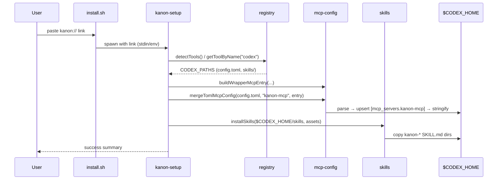

# Design: Codex CLI Integration (KAN-128)

## Status: draft — Date: 2026-06-17

## Technical Approach

Add first-class **OpenAI Codex CLI** support to `packages/setup` by mirroring the OpenCode product-surface pattern (MCP + skills only, no personal harness writes) with a **TOML config adapter** for `$CODEX_HOME/config.toml`. No API or MCP server changes — wrapper-cli is already tool-agnostic.

Single registry entry `codex`; global install only (`CODEX_HOME`, default `~/.codex`).

---

## Architecture Decisions

| Decision | Choice | Alternatives rejected | Rationale |
|---|---|---|---|
| Config write path | TOML parse/merge in `mcp-config.ts` | Shell out to `codex mcp add`/`remove` | Testable without Codex binary; matches JSON direct-write pattern for all other tools |
| TOML library | `smol-toml` | `@iarna/toml`, hand-rolled parser | ESM-native, zero deps, small bundle; parse + stringify sufficient for upsert |
| Format routing | `configFormat: "json" \| "toml"` on `ToolDefinition` | Infer from file extension | Explicit dispatch in `index.ts`; avoids magic; JSON tools unchanged |
| MCP entry shape | Flat `command`/`args` + `[mcp_servers.<name>.env]` subtable | Inline `env` key, nested `transport` object | Verified against Codex CLI 0.140.0 `codex mcp add` output |
| Product surface | MCP merge + skills only | Template, agents, commands | Codex has no global agents/commands dir; `AGENTS.md` is personal — must not write |
| Home resolution | `resolveCodexHome(ctx, ...segments)` | Hardcode `~/.codex` | Respects `CODEX_HOME` env; single resolver for config + skills paths |
| Platforms | `darwin`, `linux`, `wsl`, `win32`; `mcpMode: direct` | WSL-bridge for Codex | Codex is a native CLI on all four; no Windows-side bridge needed |
| Comment preservation | Accept loss on round-trip | Custom TOML AST rewriter | Only touch `mcp_servers.kanon-mcp` keys; document limitation in onboard skill |

---

## Module Design

### `resolveCodexHome(ctx, ...segments)` — `registry.ts`

```typescript
function resolveCodexHome(ctx: PlatformContext, ...segments: string[]): string {
  const base = process.env.CODEX_HOME ?? path.join(ctx.homedir, ".codex");
  return segments.length ? path.join(base, ...segments) : base;
}
```

Used by `CODEX_PATHS.config` → `config.toml`, `CODEX_PATHS.skills` → `skills/`. Tests override `CODEX_HOME` via env in temp dirs.

### `formatCodexMcpEntry(entry)` — `mcp-config.ts`

Returns `{ command, args, env? }` for TOML serialization. Same object form as Claude/Cursor (`mcpServers`), **not** OpenCode's array form. Env maps to nested `[mcp_servers.kanon-mcp.env]` subtable, not inline keys.

Extend `formatMcpEntry` to delegate when `rootKey === "mcp_servers"` and caller passes `configFormat: "toml"`, or export `formatCodexMcpEntry` as the TOML writer's single entry point.

### `mergeTomlMcpConfig(configPath, serverName, entry)` — `mcp-config.ts`

1. Parse existing TOML (or start `{}` if missing/invalid).
2. Ensure `mcp_servers` table exists; delete legacy `kanon` key if present.
3. Upsert `mcp_servers[serverName]` with `command` + `args`.
4. If `entry.env`, set `mcp_servers[serverName].env`; else delete `.env` subtable.
5. Stringify with trailing newline; create parent dirs.

Idempotent — overwrites `kanon-mcp` only.

### `removeTomlMcpConfig(configPath, serverName)` — `mcp-config.ts`

Parse TOML, delete `mcp_servers[serverName]` (and nested `.env`), stringify. Returns `true` if entry existed.

### Auth / workspace extraction — `mcp-config.ts`

Add TOML branches in `extractExistingAuth` and `extractExistingWorkspaceId`:

- Read `config.toml` via `smol-toml`.
- Locate `mcp_servers.kanon-mcp`; normalize nested `.env` into `{ command, args, env }` before calling `extractAuthFromEntry`.
- Workspace ID: read `mcp_servers.kanon-mcp.env.KANON_WORKSPACE_ID`.

---

## `index.ts` Dispatch Flow

```
run() per selected tool
        │
        ├── configFormat === "toml"?
        │       ├── install → mergeTomlMcpConfig(configPath, "kanon-mcp", formatCodexMcpEntry(entry))
        │       └── remove  → removeTomlMcpConfig(configPath, "kanon-mcp")
        │
        └── else (json, default)
                ├── install → mergeConfig(configPath, rootKey, entry)
                └── remove  → removeConfig(configPath, rootKey)

        ├── installSkills(skillDir, assetsDir)     ← always (codex has skills path)
        ├── template / agents / commands branches  ← skipped (no paths declared)
        └── extractExistingWorkspaceId             ← TOML branch when configFormat === "toml"
```

Update `--tool` help string to include `codex`.

---

## Install Flow (Sequence)



---

## File Changes

| File | Action | Description |
|------|--------|-------------|
| `packages/setup/src/types.ts` | Modify | Add `configFormat?: "json" \| "toml"` (default `"json"`) |
| `packages/setup/src/registry.ts` | Modify | `CODEX_PATHS`, `resolveCodexHome`, `codex` entry |
| `packages/setup/src/mcp-config.ts` | Modify | TOML merge/remove, format + auth/workspace TOML branches |
| `packages/setup/src/index.ts` | Modify | Dispatch on `configFormat`; `--tool codex` help |
| `packages/setup/package.json` | Modify | Add `smol-toml` dependency |
| `packages/setup/src/__tests__/registry.test.ts` | Modify | G5-style `describe("registry — codex")` |
| `packages/setup/src/__tests__/codex-install-smoke.test.ts` | Create | Composed install/remove smoke |
| `packages/setup/src/__tests__/mcp-config.test.ts` | Modify | TOML merge/remove/auth/workspace cases |
| `packages/setup/src/__tests__/leakage-guard.test.ts` | Modify | Codex `AGENTS.md` forbidden |
| `docs/AI_TOOLS.md` | Modify | Codex row + paths table |
| `packages/setup/assets/skills/kanon-onboard/SKILL.md` | Modify | Codex troubleshooting section |

---

## Interfaces / Contracts

```typescript
// types.ts
export interface ToolDefinition {
  // ...existing fields...
  configFormat?: "json" | "toml"; // default "json"
}

// registry.ts
export function resolveCodexHome(ctx: PlatformContext, ...segments: string[]): string;

// mcp-config.ts
export function formatCodexMcpEntry(entry: McpServerEntry): {
  command: string;
  args: string[];
  env?: Record<string, string>;
};

export function mergeTomlMcpConfig(
  configPath: string,
  serverName: string,
  entry: ReturnType<typeof formatCodexMcpEntry>,
): void;

export function removeTomlMcpConfig(
  configPath: string,
  serverName: string,
): boolean;
```

**On-disk target (wrapper mode):**

```toml
[mcp_servers.kanon-mcp]
command = "<node>"
args = ["<wrapper-cli.js>", "--server", "<url>"]

[mcp_servers.kanon-mcp.env]
KANON_WORKSPACE_ID = "<id>"   # when re-run preserves binding
```

---

## Testing Strategy

| Layer | What to Test | Approach |
|-------|-------------|----------|
| Registry contract | `codex` entry, `rootKey`, `configFormat`, platforms, paths, no template/agents | `registry.test.ts` — mirror OpenCode G5 block |
| TOML merge/remove | Upsert, idempotency, env subtable, legacy `kanon` cleanup, missing file | `mcp-config.test.ts` — temp `config.toml` files |
| Auth extraction | Static-key env subtable; wrapper `--server` argv | `mcp-config.test.ts` — TOML fixtures + `extractAuthFromEntry` |
| Workspace ID | Re-run preservation from `.env` subtable | `mcp-config.test.ts` — `extractExistingWorkspaceId` TOML branch |
| Smoke | Full install/remove sequence | `codex-install-smoke.test.ts` — temp HOME + `CODEX_HOME` override + real assets |
| Leakage guard | No `AGENTS.md` path; no template/agents/commands | Extend `leakage-guard.test.ts` for codex |
| CODEX_HOME override | Config + skills land under env path | Smoke test with `process.env.CODEX_HOME` |

Runner: `pnpm --filter @kanon/setup test`

Smoke test drives composed primitives (`mergeTomlMcpConfig`, `installSkills`, etc.) — **not** `run()` — same rationale as OpenCode smoke.

---

## Alternatives Considered

| Approach | Why rejected |
|---|---|
| `codex mcp add`/`remove` shell-out | Requires Codex on PATH; flaky spawn tests; inconsistent with JSON direct-write |
| Hybrid (CLI write, TOML read) | Two code paths; worst maintenance for remove idempotency |
| `@iarna/toml` | Heavier; `smol-toml` sufficient for flat table upsert |
| Project-scoped `.codex/config.toml` | Out of scope; global `$CODEX_HOME` only |
| Write `$CODEX_HOME/AGENTS.md` | Personal harness — forbidden by product-surface policy |

---

## Migration / Rollout

No migration required. Ships in next setup tarball cut. Manual rollback: delete `[mcp_servers.kanon-mcp]` from `config.toml` and `kanon-*` under `$CODEX_HOME/skills`.

---

## Open Questions

- [ ] None blocking — win32 platform inclusion confirmed in proposal (exploration deferred; implement per proposal assumptions).
