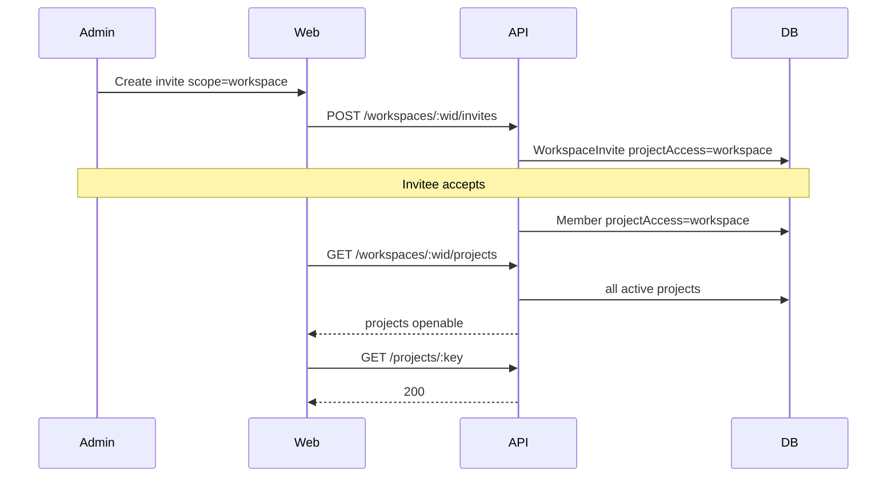

# Design: invite-access-hardening

## Decision: explicit `projectAccess` mode

**Choice:** Add `ProjectAccess` enum (`workspace` | `assigned`) on `Member` and
`WorkspaceInvite`.

**Rationale:** Product needs both “all projects including future” and “only these
projects”. Inferring from PM row count cannot distinguish workspace-wide access
from an assigned member with zero projects.

### Alternatives considered

| Alt | Why rejected |
|-----|--------------|
| Infer from empty PM + workspace membership → full access | Breaks selected-project invites that intentionally grant zero PMs briefly; also unlocks every historical member |
| Always create PM rows for all projects on workspace invite + job on project create | More moving parts; race on new projects; harder rollback |
| Elevate invitees to workspace `admin` | Over-privileged; wrong role semantics |

## Authz algorithm

Shared visibility for list and open:

```text
if token.allowedProjectIds non-empty and project ∉ allowlist → deny
if not workspace Member → deny
if role in (owner, admin) → allow (effectiveRole = ws role)
if member.projectAccess == workspace → allow (effectiveRole = ws role)
if ProjectMember row exists → allow (effectiveRole = pm.role)
else → deny
```

`listProjects` applies the same predicate as a Prisma `where` (or post-filter for
workspace mode = all non-archived ∩ token).

## Invite apply

| Invite.projectAccess / UI scope | Member.projectAccess | ProjectMembers |
|---------------------------------|----------------------|----------------|
| `workspace` | `workspace` | none required |
| `all` (UI) | `assigned` | one per current project |
| `selected` (UI) | `assigned` | selected IDs |

`CreateInviteBody` gains `projectAccess: workspace | assigned` (default `workspace`).
When `assigned`, `projectAssignments` MUST be non-empty.

Empty-workspace behavior for UI scope `all`: the web form disables `all` /
`selected` when the target workspace has zero projects (and resets to
`workspace` if the picker switches to an empty workspace while `all`/`selected`
was selected). The API still rejects `assigned` + empty assignments.

## Workspace picker (web)

No new API. Form loads workspaces from `GET /api/workspaces` where caller role is
owner/admin; `POST /api/workspaces/:selectedWid/invites`. Project checklist uses
selected workspace’s project list.

## Sequence



## Prisma

```prisma
enum ProjectAccess {
  workspace
  assigned
}

model Member {
  projectAccess ProjectAccess @default(assigned) @map("project_access")
  ...
}

model WorkspaceInvite {
  projectAccess ProjectAccess @default(workspace) @map("project_access")
  ...
}
```

Migration: add enum + columns; existing members → `assigned`; existing invites →
`workspace` if assignments null/empty else `assigned`.
