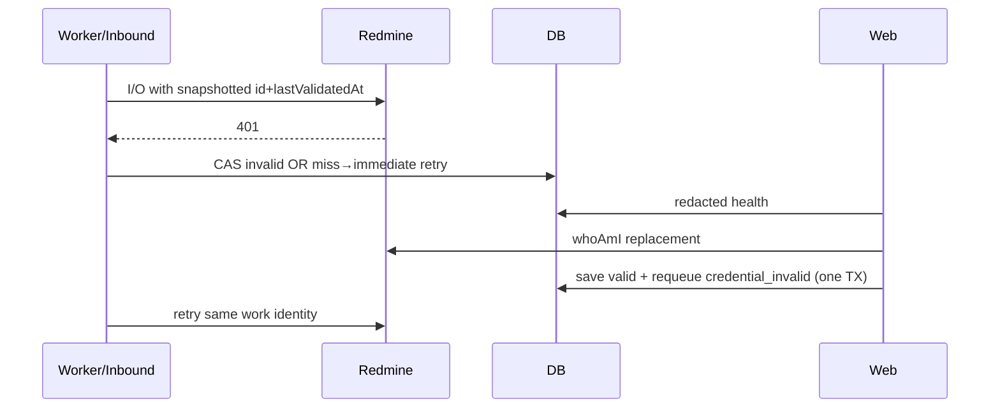

# Design: KAN-211 — Redmine credential recovery

## Technical Approach

Add 401-only, race-safe credential invalidation and validated replace+redrive on the
existing integration outbox — no Prisma schema. Fence with credential `id` +
`lastValidatedAt` CAS (upsert reuses row id). Spec:
`specs/redmine-credential-recovery/spec.md`. Packages: `@kanon/api`, `@kanon/shared`,
`@kanon/web`. **Apply gate:** rebase onto `main` after merged KAN-209 PR #248 before
implementation; do not touch KAN-210 schema work.

## Architecture Decisions

| Decision | Choice | Rejected | Rationale |
|---|---|---|---|
| Auth class | HTTP 401 only via `statusCode` | 403 / all 4xx | 403 is permission, not revoked key |
| Fence | CAS `id` + `lastValidatedAt` + `valid` | id-only; new version column | Same-row upsert; CAS miss → retry keeps key B; avoids KAN-210 schema churn |
| Blocked work | `dead` + `skippedReason=credential_invalid` | endless retry / `skipped` | User action resolves; queryable + redriveable |
| Connection | Stay `active` | pause/disable connection | Credential-scoped; other users keep working |
| Requeue | In successful replace TX | manual second call | Atomic recovery; preserve identity |
| Service replace | New admin PUT on #248 surfaces | reuse `createConnection` | Setup has broader side effects; recovery needs replace-sans-discovery |
| Schema | None | `credentialVersion` | Existing fields suffice |

## Data Flow



Late race: A in flight → B validated → A 401 → CAS 0 rows → keep B; work `retry`
`availableAt=now` (do not burn attempt budget / do not set `credential_invalid`).

## File Changes

| File | Action | Description |
|---|---|---|
| `packages/api/.../core/types.ts` | Modify | `isProviderAuthenticationError` (401-only) |
| `packages/api/.../worker.ts` | Modify | Snapshot fence in `credential`/`Prepared`; 401 `fail` path; already-`invalid` → dead+reason no I/O; bulk requeue helper |
| `packages/api/.../inbound.ts` | Modify | Snapshot on claim; 401 CAS invalidate; `safeErrorEvidence` logs |
| `packages/api/.../service.ts` | Modify | Personal/service replace TX + requeue; extend `getConnection` health |
| `packages/api/.../routes.ts` | Modify | Admin service-credential replace route |
| `packages/shared/src/integrations.ts` | Modify | Health / blocked-work DTO |
| `packages/web/.../redmine-section.tsx` | Modify | Personal invalid + member blocked UX |
| `packages/web/.../admin-redmine-section.tsx` | Modify | Service replace without discovery; blocked list |
| `packages/web/.../use-redmine-integration.ts` + i18n | Modify | Mutations/keys en/es |
| Matching `*.test.ts(x)` | Modify | Unit/integration coverage below |
| `schema.prisma` / KAN-210 | **None** | Verified: `lastValidatedAt`, `lastAuthStatus`, `skippedReason`, `authCredentialId`, `dedupeKey`, `correlationId` |

## Interfaces / Contracts

```ts
// Internal snapshot (prepare/claim) — not a public DTO
type UsedCredential = { id: string; lastValidatedAt: Date | null };

// CAS (raw or Prisma updateMany): id + lastAuthStatus='valid' + revokedAt null
// + lastValidatedAt IS NOT DISTINCT FROM snapshot

// Extend IntegrationConnection (post-#248 schema):
serviceCredentialStatus: "missing"|"unknown"|"valid"|"invalid"|"revoked";
syncHealth: {
  state: "healthy"|"credential_blocked";
  authBlockedWorkCount: number|null; // null for non-owner/non-admin
  authBlockedWork: Array<{ // ≤20; owners/admins only
    id: string; entityType: string; operation: string;
    localKey: string|null; failedAt: string; reason: "credential_invalid";
  }>;
};
```

- Personal: extend `POST /credentials` (`connectCredential`) — `whoAmI` then TX
  upsert `valid` + new `lastValidatedAt` + requeue matching rows.
- Service: `PUT /connections/:id/service-credential` — instance admin + workspace
  member; validate first; upsert caller credential; set `serviceCredentialId`;
  requeue service-scoped `credential_invalid` (rebind system/ai rows if holder
  changes). Failed validation: no writes (`REDMINE_CONNECTION_FAILED`).
- Already-`invalid` prepare: no provider I/O; `dead`+`credential_invalid`.
  Missing/revoked/cross-workspace/actor-mismatch: keep existing `skipped` reasons.
- Requeue preserves work id, `dedupeKey`, `correlationId`, payload, refs, attempts.
  Other-reason dead untouched. Definitive 401 creates are safe to retry (no auth).

## Testing Strategy

| Layer | What | Approach |
|---|---|---|
| Unit | 401-only class; redaction | `types.test.ts`, http/adapter regressions |
| Integration | Fence win/lose, already-invalid, inbound stop/resume, replace TX, health ACL | `retry.test.ts`, `inbound.test.ts`, `credentials.test.ts`, routes |
| Web | Personal invalid, member blocked, admin replace-sans-discovery | `redmine-section.test.tsx`, admin section tests |
| E2E | Optional smoke after #248 rebase | Playwright only if time |

## Migration / Rollout

No migration. Code revert restores prior behavior. Delivery: (1) worker/inbound fence,
(2) replace+health DTO, (3) web UX — chained if >400 LOC. **Hard apply prerequisite:**
rebase this branch onto `main` (PR #248 merged). Avoid `schema.prisma`.

## Open Questions

None blocking — residual same-ms `lastValidatedAt` collision accepted; harden later
only if observed.
