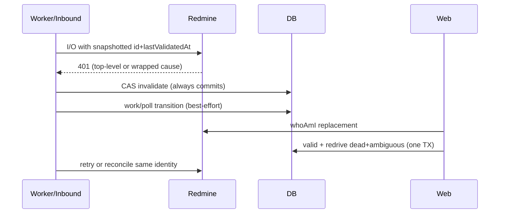

# Design: KAN-211 — Redmine credential recovery

## Technical Approach

401-only credential invalidation and validated replace+redrive on the integration outbox — no Prisma schema. Connection **stays active**; only rejected credential becomes `invalid`. Snapshot `id`+`lastValidatedAt` before I/O; CAS-invalidate while `valid`. Classify top-level or `ProviderDispatchError.cause` 401 only — no message/deeper parsing. Definitive 401 → `dead`/`credential_invalid`; reconcile 401 → `ambiguous` auth-block (`skippedReason`, far `availableAt`, `claimAmbiguous` exclusion). CAS commits first when lease stale; owner transitions best-effort. Unit 2: `dead`→`retry` + auth-blocked `ambiguous` due now (reconcile only). Spec: `specs/redmine-credential-recovery/spec.md`. Gate: rebase after KAN-209 #248.

## Architecture Decisions

| Decision | Choice | Rejected | Rationale |
|---|---|---|---|
| Auth class | top-level or `ProviderDispatchError.cause` 401 | message parse; 403 | Spec; 403 is permission |
| Connection | remain `active` on personal 401 | auto-pause | Out-of-scope; credential truth only |
| Definitive 401 | `dead` + `credential_invalid` | retry create | User action required |
| Ambiguous 401 | `ambiguous` + `credential_invalid` + blocked `availableAt` | `dead`/`retry` | No dupe create |
| Invalidation | CAS commits first | single TX with work | Stale lease must not roll back truth |
| CAS miss | immediate retry; no attempt burn | count failure | Late-key race preserves key B |
| Already-invalid | block without I/O | remote probe | Other skip reasons unchanged |
| Owner TX | best-effort lease transition | fail auth path | Optional per spec |
| Redrive (U2) | one TX: valid + dead→retry + ambiguous due-now | manual requeue | Atomic; preserve identity |
| Replace | `whoAmI` before write; zero writes on fail | save-then-validate | Spec contract |
| Service replace | `PUT .../service-credential`; admin auth; rebind holder | discovery prerequisite | Fix when discovery 401 |
| Schema | none | `credentialVersion` | Existing fields suffice |

## Data Flow



Late race: A in flight → B validated → A 401 → CAS 0 rows → B stays `valid`; work retries without burning attempts.

## File Changes

| File | Action | Description |
|---|---|---|
| `packages/api/src/modules/integrations/core/types.ts` | Modify | `isProviderAuthenticationError` (top-level or cause 401) |
| `packages/api/src/modules/integrations/core/types.test.ts` | Modify | Classifier scenarios |
| `packages/api/src/modules/integrations/worker.ts` | Modify | CAS invalidate; auth modes; claim skip; redrive (U2) |
| `packages/api/src/modules/integrations/retry.test.ts` | Modify | Four integration scenarios |
| `packages/api/src/modules/integrations/inbound.ts` | Modify | `rejectCredential`: invalidate then best-effort lease release |
| `packages/api/src/modules/integrations/inbound.test.ts` | Modify | Inbound 401 + reclaimed lease |
| `packages/api/src/modules/integrations/service.ts` | Modify (U2) | `whoAmI` gate; atomic valid + redrive |
| `packages/api/src/modules/integrations/routes.ts` | Modify (U2) | `PUT .../service-credential` (instance-admin/workspace auth) |
| `packages/api/src/modules/integrations/credentials.test.ts` | Modify (U2) | Replace validation + redrive |
| `packages/shared/src/integrations.ts` | Modify (U2) | `serviceCredentialStatus`, `credential_blocked`, blocked-work DTO |
| `packages/web/src/features/settings/redmine-section.tsx` | Modify (U3) | Blocked/remediation UX; replace sans discovery |
| `packages/web/src/features/settings/use-redmine-integration.ts` | Modify (U3) | Service-credential mutation hook |
| `packages/web/src/features/settings/redmine-section.test.tsx` | Modify (U3) | Member redaction; admin replace |
| `packages/api/prisma/schema.prisma` | **None** | Verified fields suffice |

## Interfaces / Contracts

```ts
type UsedCredential = { id: string; lastValidatedAt: Date | null };
function isProviderAuthenticationError(error: unknown): boolean;
async function invalidateObservedCredential(db, cred: UsedCredential): Promise<boolean>;
type AuthFailureMode = "definitive" | "ambiguous";
async function redriveAuthBlockedWork(tx, connectionId, credentialId, scope): Promise<number>;
```

CAS on `id`+`lastValidatedAt`; redrive preserves id/`dedupeKey`/`correlationId`/payload/refs/attempts; other dead untouched. Personal: `connectCredential` + `whoAmI`. Service: `PUT .../service-credential`; admin auth; rebind holder. Already-`invalid`: no I/O. Health: `serviceCredentialStatus`, `credential_blocked`; admin/owner total + ≤20; members redacted. No secrets in logs/API/UI.

## Testing Strategy

| Layer | What | Approach |
|---|---|---|
| Unit | Classifier | `types.test.ts`: top-level 401; wrapped cause 401; 403 false |
| Integration 1 | Definitive fence | `retry.test.ts`: 401→dead/`credential_invalid`; A→B race; 403 unchanged |
| Integration 2 | Ambiguous auth-block | `retry.test.ts`: reconcile 401 stays blocked; `claimAmbiguous` no loop |
| Integration 3 | Stale leases | `retry.test.ts`+`inbound.test.ts`: cred `invalid` commits; transition best-effort |
| Integration 4 | Ambiguous resume (U2) | replace TX due-now reconcile only; other dead untouched |
| Web (U3) | UX | `redmine-section.test.tsx`: member block; admin replace sans discovery; ≤20 |

## Migration / Rollout

No migration. Chain: Unit 1A → 1B → Unit 2 → Unit 3.

**Review guard:** Unit 1A = **400** LOC (done). Unit 1B ~120–180 (cause classifier, ambiguous block, lease split, four scenarios). 1B stacked child on `fix/kan-211-redmine-auth-fence`. Units 2–3 unchanged. Forecast: `Decision needed: No` | `Chained PRs: Yes` | `400-line risk: High` (mitigated).

## Open Questions

None blocking. The CAS matches both `lastValidatedAt` and the observed ciphertext, so a replacement with distinct credential material cannot collide at timestamp precision.
